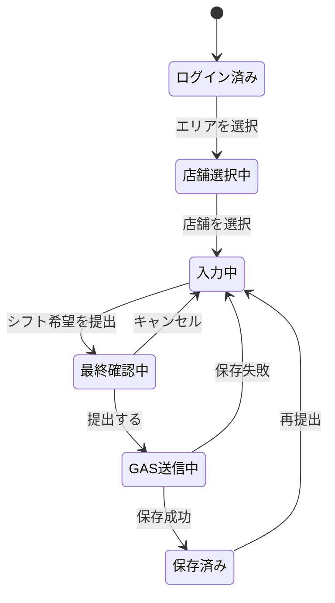
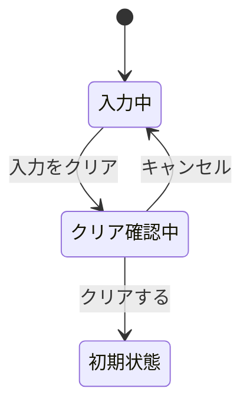
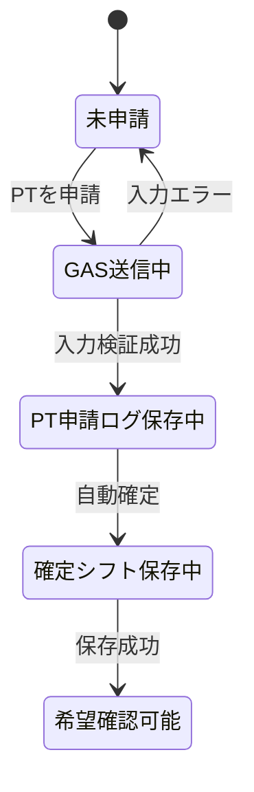
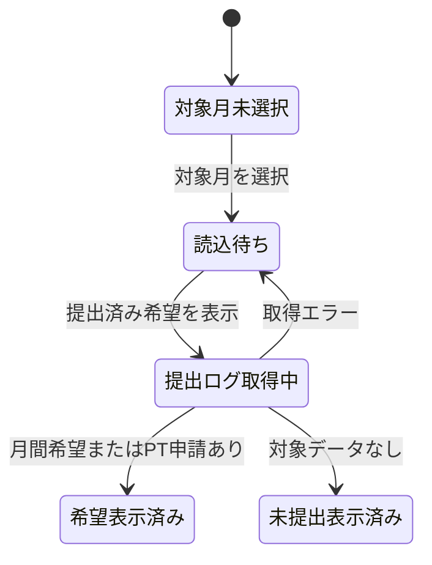
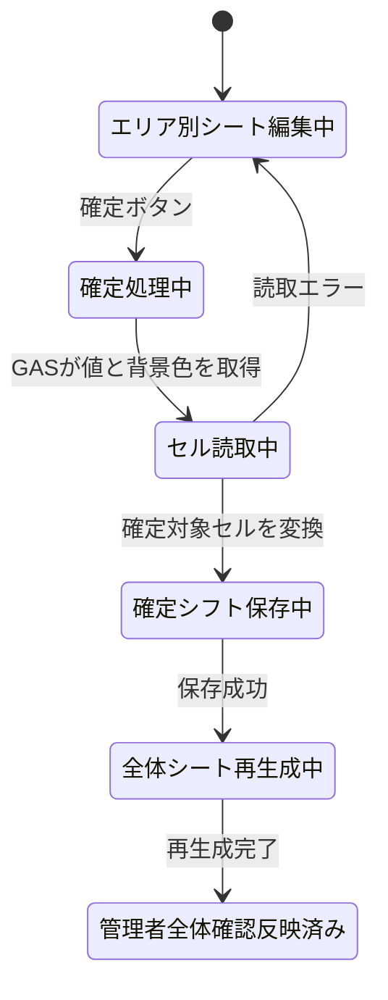
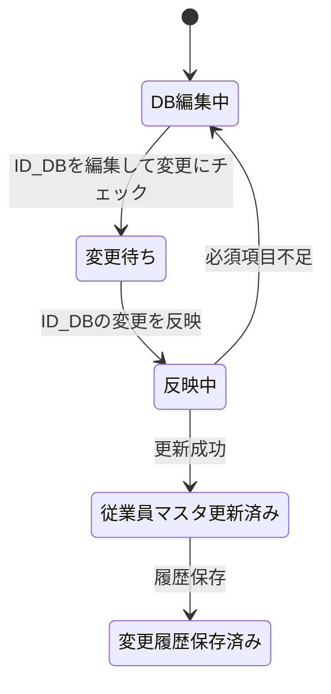
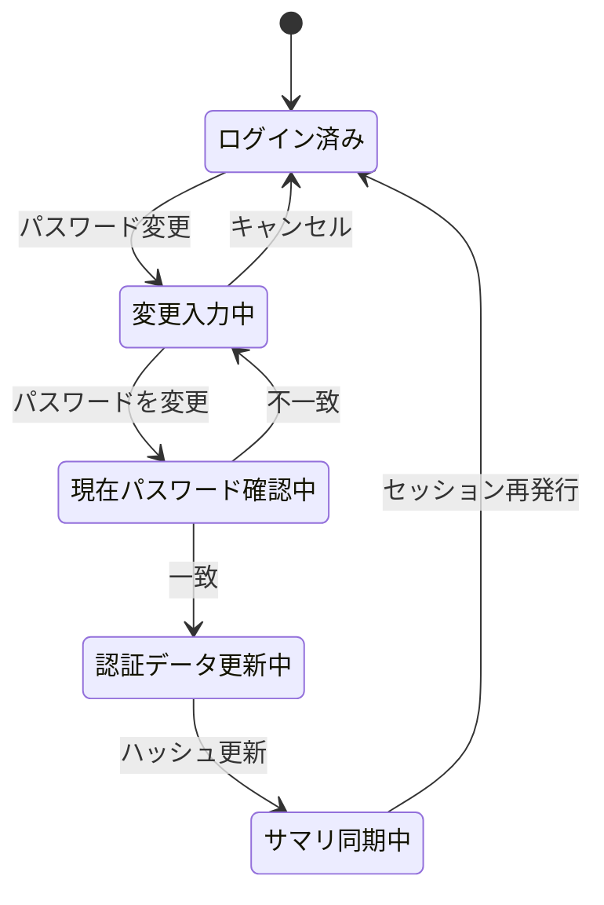

# シフト提出・希望確認システム 設計書

## 前提

- フロント画面は `GasApp.html`、バックエンドは `Code.gs` で構成する。
- フロントからGASへは `google.script.run` で送信する。
- システムは、全体確認用、DB管理用、エリア確認用、提出ログ用の4つのスプレッドシートを使う。
- エリア、店舗、従業員、所属店舗、管理対象ファイルはDB管理用スプレッドシートを正とする。
- コード内のスプレッドシートID定数は予備値であり、原則として `管理対象ファイル` シートを優先する。
- セル色は見やすさと確定判定の補助に使う。正データは `確定シフト` シートに保存する。
- 従業員向けWebアプリは提出済み希望だけを表示し、現段階では `確定シフト` を取得・表示しない。

## 1. 機能分解

### 1.1 シフト希望提出

- エリア、店舗、対象月を選択し、名前はログイン中の従業員に固定する。
- 1か月分の各日に対して、`未入力`、`勤務可能`、`休み希望`、`有給希望`、`PT` を入力する。
- `勤務可能` は11:00〜20:00、`PT` は07:00〜22:00から開始時刻と終了時刻を入力する。
- 開始時刻が終了時刻と同じ、または終了時刻より遅い場合はエラーにする。
- 備考を入力する。
- 提出ボタン押下時に最終確認画面を表示する。
- 確定ボタン押下後にGASへ送信する。
- 同じ従業員、同じ対象月は更新扱いにする。

### 1.2 入力クリア

- 入力クリアボタン押下時に最終確認画面を表示する。
- `クリアする` で入力内容と下書きを削除する。
- `キャンセル` で押下前の入力状態へ戻る。

### 1.3 下書き保存

- 入力中の内容をローカルストレージに保存する。
- 画面起動時に下書きがあれば自動復元する。
- 手動復元ボタンは表示しない。

### 1.4 PT申請

- PT勤務日、勤務エリア、勤務店舗、開始時刻、終了時刻、備考を入力する。
- 時刻は07:00〜22:00から選び、開始時刻が終了時刻より前であることを検証する。
- 通常シフト希望とは別に `PT申請` シートへ保存する。
- 承認不要の運用では自動で `確定シフト` に反映する。
- PT申請は前日まで可能とする。

### 1.5 希望確認

- 対象月を指定して、ログイン中の本人が提出した月間希望とPT申請履歴を取得する。
- 本人IDは画面入力ではなく、有効なログインセッションから決定する。
- 月間希望は提出ログ用スプレッドシートの `シフト希望` から取得する。
- PT申請履歴は同じファイルの `PT申請` から取得する。
- 希望確認処理では全体確認用スプレッドシートを開かず、`確定シフト` も取得しない。
- データがない場合は、対象月に提出済み希望がないことを表示する。

### 1.6 エリア別シート調整

- 店長・エリア管理者はエリア確認用スプレッドシートでシフトを調整する。
- セル値に勤務時間、PT、有給、NGなどを入力する。
- 背景色で通常勤務、ヘルプ、調整中、休みを表す。
- 確定ボタンでセル値と背景色を読み取り、確定シフトへ反映する。

### 1.7 全体反映

- 確定シフト保存後、全体確認用スプレッドシートの `全体_YYYY-MM` を再生成する。
- エリア確認用スプレッドシートの `エリア_エリアID_YYYY-MM` を再生成する。
- 変更履歴を保存する。

### 1.8 DB管理

- `エリアマスタ`、`店舗マスタ`、`従業員マスタ`、`従業員店舗設定`、`管理対象ファイル` をDB管理用スプレッドシートに置く。
- 店舗や従業員の増減は、DB管理用スプレッドシートの行追加・編集・有効フラグ変更で対応する。
- `ID_DB` で従業員情報を編集し、メニュー `ID_DBの変更を反映` で `従業員マスタ` へ反映する。

### 1.9 ログイン・パスワード管理

- 従業員IDとパスワードで本人を認証する。
- 初回登録では従業員マスタのIDと一致することを確認してからパスワードを登録する。
- メイン画面の `パスワード変更` で、現在のパスワードを検証してから新しいパスワードへ変更する。
- 認証アカウントとセッションは提出ログ用スプレッドシートへ保存する。
- DB管理用スプレッドシートには、従業員IDとパスワードハッシュのサマリを同期する。
- 旧DB管理用ファイルからはログインアカウントだけを移行し、旧セッションは再利用しない。

## 2. リストアップした機能を「誰が使うか」に分類する

| 利用者 | 機能 | 目的 |
| --- | --- | --- |
| 従業員 | シフト希望提出 | 1か月分の勤務可能日、休み希望、有給希望、PT希望を提出する |
| 従業員 | ログイン・初回登録 | 従業員IDで本人を特定し、自分の画面を開く |
| 従業員 | パスワード変更 | 現在のパスワードを確認して新しいパスワードへ変更する |
| 従業員 | 入力クリア | 入力内容を確認後に削除する |
| 従業員 | PT申請 | 通常シフトとは別にPT勤務を申請する |
| 従業員 | 希望確認 | 自分の月間希望とPT申請履歴を確認する |
| 店長 | エリア別シート編集 | 担当エリアまたは店舗のシフトを調整する |
| 店長 | 確定ボタン | 調整済みシフトを全体確認用ファイルへ反映する |
| エリア管理者 | エリア全体確認 | エリア内の店舗配置とヘルプを確認する |
| エリア管理者 | ヘルプ調整 | 所属店舗と勤務店舗が異なる勤務を調整する |
| システム管理者 | DB管理 | エリア、店舗、従業員、所属、ファイルIDを管理する |
| システム管理者 | 全体確認 | 全エリア、全店舗の確定シフトを確認する |
| システム管理者 | 提出ログ確認 | 希望提出状況とPT申請ログを確認する |

## 3. DB（スプレッドシート）に格納するデータ種別を設計する

### 3.1 スプレッドシートファイル構成

| ファイル種別 | 定数 | 保存する主なシート |
| --- | --- | --- |
| 全体確認用 | `OVERALL_SPREADSHEET_ID` | `確定シフト`, `変更履歴`, `全体_YYYY-MM` |
| DB管理用 | `ADMIN_SPREADSHEET_ID` | `エリアマスタ`, `店舗マスタ`, `従業員マスタ`, `従業員店舗設定`, `管理対象ファイル`, `ID_DB`, `従業員パスワードサマリ` |
| エリア確認用 | `AREA_SPREADSHEET_ID` | `エリア_エリアID_YYYY-MM`, `管理対象ファイル` |
| 提出ログ用 | `SUBMISSION_LOG_SPREADSHEET_ID` | `シフト希望`, `PT申請`, `ログインアカウント`, `ログインセッション` |

### 3.2 エリアマスタ

| カラム | 内容 |
| --- | --- |
| エリアID | エリアを一意に識別するID |
| エリア名 | 画面表示名 |
| 表示順 | 選択肢やシート上の表示順 |
| 有効フラグ | 使用中かどうか |

### 3.3 店舗マスタ

| カラム | 内容 |
| --- | --- |
| 店舗ID | 店舗を一意に識別するID |
| 店舗名 | 画面表示名 |
| 短縮名 | シフト表の短縮表示 |
| エリアID | 所属エリア |
| 表示順 | 表示順 |
| 有効フラグ | 使用中かどうか |

### 3.4 従業員マスタ

| カラム | 内容 |
| --- | --- |
| 従業員ID | 従業員を一意に識別するID |
| 氏名 | 従業員名 |
| 主所属エリアID | 主所属エリア |
| 主所属店舗ID | 主所属店舗 |
| 雇用区分 | 社員、アルバイトなど |
| 役職 | 店長、トレーナーなど |
| 権限 | 従業員、店長、エリア管理者、システム管理者 |
| 表示順 | 名前候補やシフト表の表示順 |
| 有効フラグ | 在籍中かどうか |

### 3.5 従業員店舗設定

| カラム | 内容 |
| --- | --- |
| 従業員ID | 対象従業員 |
| エリアID | 対象エリア |
| 店舗ID | 対象店舗 |
| 関係区分 | 主所属、兼務、ヘルプ可など |
| 通常表示 | 通常の名前候補に表示するか |
| ヘルプ候補表示 | ヘルプ候補に表示するか |
| 有効フラグ | 使用中かどうか |

### 3.6 管理対象ファイル

| カラム | 内容 |
| --- | --- |
| 管理単位 | 全体確認、エリア確認、提出ログなど |
| エリアID | 対象エリア。全体や提出ログでは空欄可 |
| 店舗ID | 対象店舗。エリア単位では空欄可 |
| スプレッドシートID | 接続先スプレッドシートID |
| 用途 | 全体確認、エリア調整、提出ログなど |
| 編集権限者 | 編集できる利用者 |
| 有効フラグ | 使用中かどうか |

GASは `管理対象ファイル` を読み、対象のスプレッドシートIDを取得する。該当行がない場合は、コード先頭の定数を予備値として使う。

### 3.7 シフト希望

| カラム | 内容 |
| --- | --- |
| 希望ID | `HOPE-YYYY-MM-従業員ID` |
| 対象月 | `YYYY-MM` |
| 従業員ID | 提出者 |
| 氏名 | 提出者名 |
| 所属エリアID | 提出時の所属エリア |
| 所属店舗ID | 提出時の所属店舗 |
| 提出日時 | 最終提出日時 |
| 提出状態 | 提出済みなど |
| 勤務日数 | 勤務可能の件数 |
| 休み日数 | 休み希望の件数 |
| 有給日数 | 有給希望の件数 |
| PT日数 | PTの件数 |
| 未入力日数 | 未入力の件数 |
| 希望JSON | 日別希望データ |
| 希望表示 | 人が確認しやすい表示 |
| 備考 | 本人の連絡事項 |

### 3.8 PT申請

| カラム | 内容 |
| --- | --- |
| PT申請ID | PT申請を一意に識別するID |
| 従業員ID | 申請者 |
| 氏名 | 申請者名 |
| 所属店舗ID | 申請者の所属店舗 |
| 勤務エリアID | 実際に勤務するエリア |
| 勤務店舗ID | 実際に勤務する店舗 |
| 勤務日 | PT勤務日 |
| 開始時刻 | PT開始 |
| 終了時刻 | PT終了 |
| 申請日時 | 申請日時 |
| 状態 | 自動確定、申請中など |
| 備考 | 補足 |

### 3.9 確定シフト

| カラム | 内容 |
| --- | --- |
| 確定シフトID | 確定データのID |
| 対象月 | `YYYY-MM` |
| 日付 | 勤務日 |
| 従業員ID | 勤務者 |
| 氏名 | 勤務者名 |
| 所属エリアID | 所属エリア |
| 所属店舗ID | 所属店舗 |
| 勤務エリアID | 実際に勤務するエリア |
| 勤務店舗ID | 実際に勤務する店舗 |
| 開始時刻 | 勤務開始 |
| 終了時刻 | 勤務終了 |
| 区分 | 通常、ヘルプ、PT、有給、休み |
| 確定元 | エリア別シート、PT申請など |
| 確定日時 | 確定日時 |
| 確定者ID | 確定した利用者 |

### 3.10 変更履歴

| カラム | 内容 |
| --- | --- |
| 変更ID | 履歴ID |
| 対象データ種別 | 確定シフト、PT申請、従業員マスタなど |
| 対象ID | 対象データのID |
| 変更前 | 変更前の内容 |
| 変更後 | 変更後の内容 |
| 変更理由 | 変更理由 |
| 変更者ID | 操作した利用者 |
| 変更日時 | 操作日時 |

### 3.11 ログインアカウント

| カラム | 内容 |
| --- | --- |
| 従業員ID | 従業員マスタと共通のID |
| パスワードハッシュ | ソルトを使って複数回ハッシュ化した値 |
| パスワードソルト | 従業員ごとのランダム値 |
| 登録日時 | 初回登録日時 |
| 最終ログイン日時 | 最後にログインした日時 |
| 有効フラグ | アカウントが利用可能かどうか |
| ログイン失敗回数 | 連続失敗回数 |
| ロック期限 | 一時停止の終了日時 |
| パスワード更新日時 | 最後にパスワードを登録または変更した日時 |

### 3.12 ログインセッション

| カラム | 内容 |
| --- | --- |
| トークンハッシュ | ブラウザへ返すトークンのハッシュ |
| 従業員ID | ログイン中の本人ID |
| 発行日時 | セッション発行日時 |
| 有効期限 | セッションの失効日時 |
| 最終利用日時 | 最終アクセス日時 |
| 有効フラグ | セッションが利用可能かどうか |

### 3.13 従業員パスワードサマリ

| カラム | 内容 |
| --- | --- |
| 従業員ID | 対象従業員ID |
| パスワードハッシュ | 認証アカウントと同じハッシュ値。平文とソルトは保存しない |
| 更新日時 | パスワードの登録または変更日時 |
| 有効フラグ | アカウントが利用可能かどうか |

## 4. フローの状態遷移で設計する

### 4.1 シフト希望提出フロー

### 4.2 入力クリアフロー

### 4.3 PT申請フロー

### 4.4 希望確認フロー

### 4.5 エリア別確定フロー

### 4.6 DB管理フロー

### 4.7 パスワード変更フロー

## 5. セル値・背景色ルール

| 背景色 | 意味 | 確定シフト反映 |
| --- | --- | --- |
| 緑 | 通常勤務の確定 | 反映する |
| 青 | ヘルプ勤務の確定 | 反映する |
| 黄 | 調整中 | 反映しない |
| 赤 | 休み、NG | 必要に応じて反映する |
| 色なし | 未確定 | 原則反映しない |

| セル値 | 解釈 |
| --- | --- |
| 空欄 + 確定色 | 標準勤務時間 |
| `11-20` | 11:00-20:00 |
| `PT15-20` | PT 15:00-20:00 |
| `有給` | 有給 |
| `NG` | 休みまたは勤務不可 |

## 6. エラー方針

| エラー | 対応 |
| --- | --- |
| 必須項目不足 | フロントでメッセージを表示し、GASへ送信しない |
| 希望未入力 | 1日以上の入力を促す |
| 勤務可能の時間範囲外 | 11:00〜20:00の範囲を案内する |
| PTの時間範囲外 | 07:00〜22:00の範囲を案内する |
| 開始時刻が終了時刻以降 | 対象日を表示し、開始時刻を終了時刻より前にするよう案内する |
| 現在のパスワード不一致 | 変更せず、現在のパスワードを再入力するよう案内する |
| 保存失敗 | エラーメッセージを表示し、入力内容は保持する |
| 店舗ID不一致 | 表示処理ではID表示で継続し、管理者がマスタを修正する |
| 受付停止 | 通常シフト希望を受け付けない |
| 確定読取エラー | 確定処理を止め、エリア別シートを修正する |
