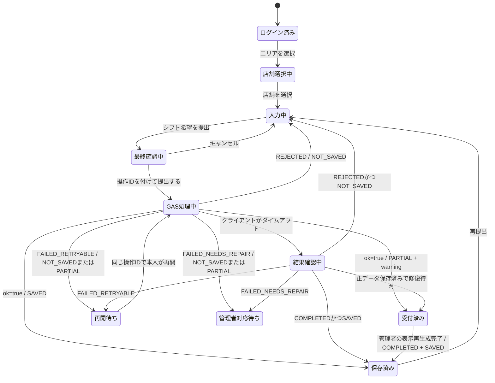
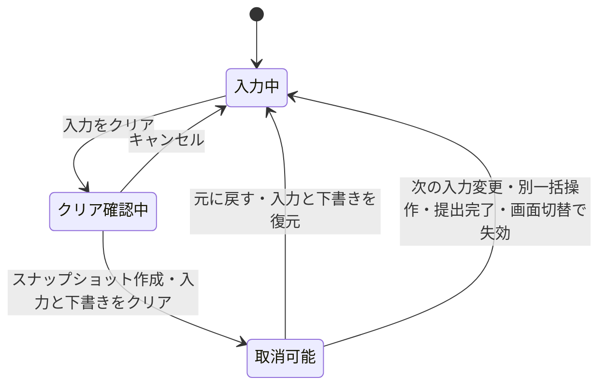
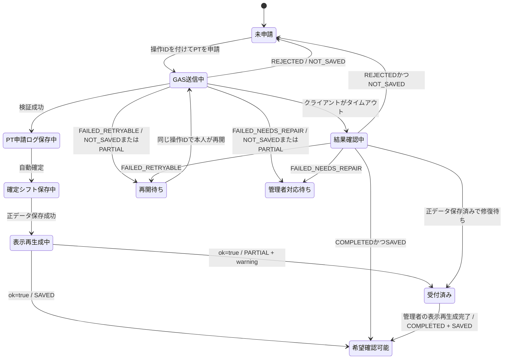
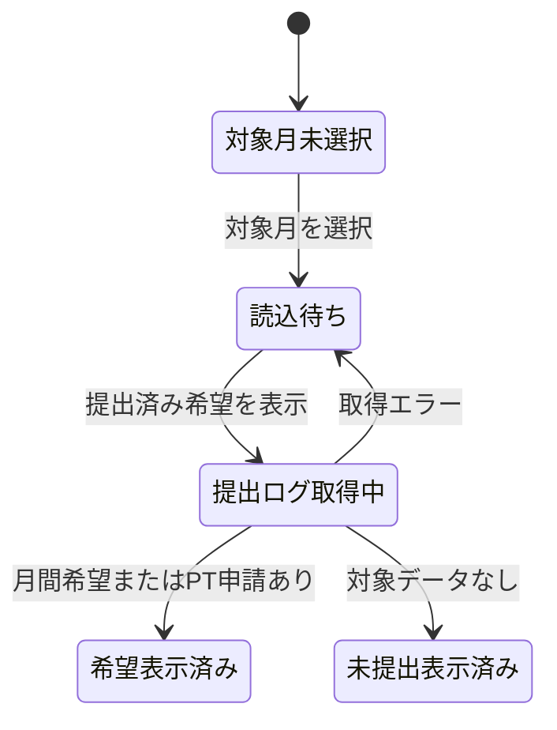
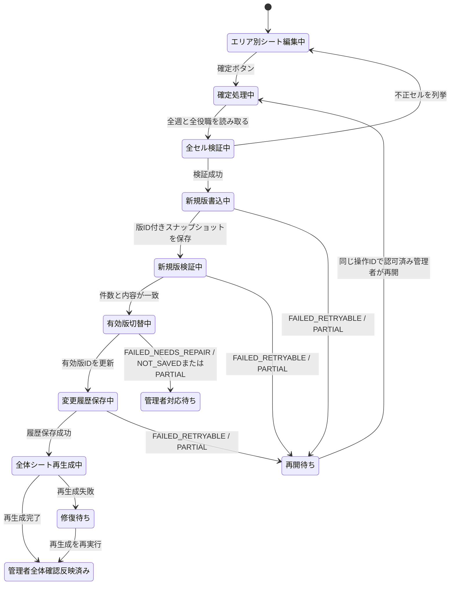
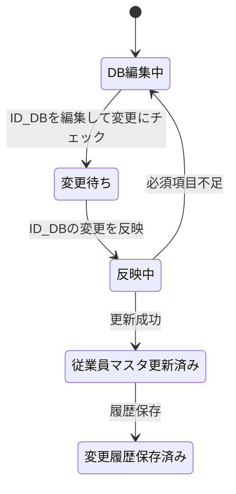
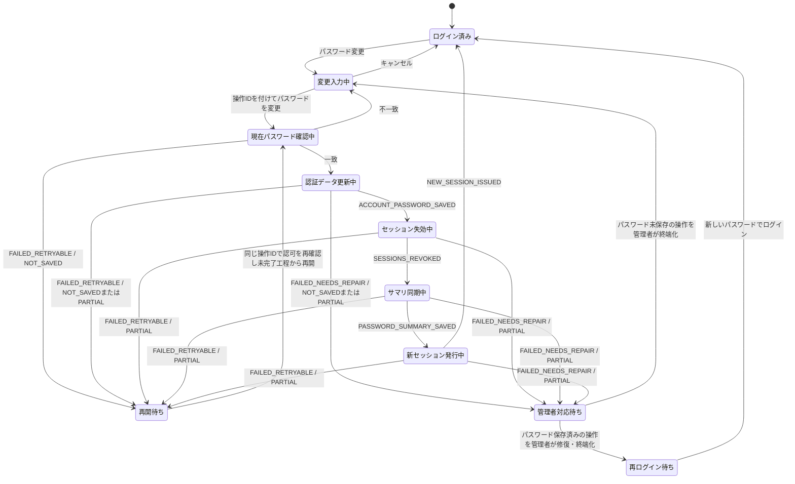
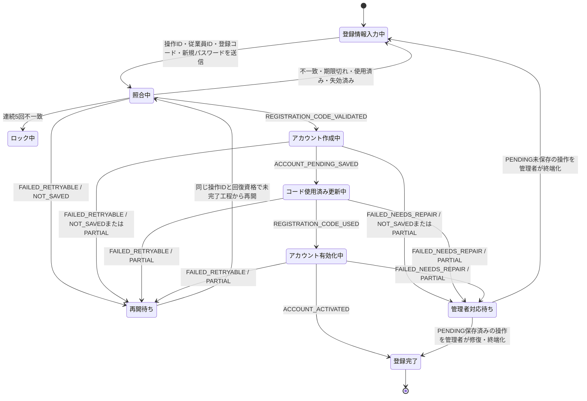
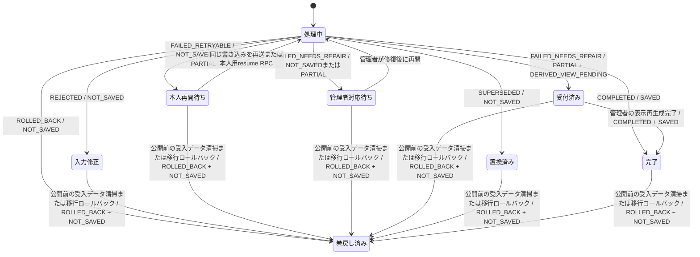

# シフト提出・希望確認システム 設計書

## 前提

- フロント画面は `GasApp.html`、バックエンドは `Code.gs` で構成する。
- フロントからGASへは `google.script.run` で送信する。
- システムは、全体確認用、DB管理用、エリア確認用、提出ログ用の4種の役割へデータを分ける。管理単位・エリア・店舗別の設定により、同じ役割で複数の物理スプレッドシートを使える。
- エリア、店舗、従業員、所属店舗、管理対象ファイルはDB管理用スプレッドシートを正とする。
- 現行コードは `管理対象ファイル` シートを優先し、指定されたエリア・店舗の完全一致行、未指定の共通行、同順位の先頭行の順で解決する。該当行がない場合はコード内のID定数へフォールバックする。確定入力元は解決したIDとシート名・月・エリアの一致をファイル読取前に検証する。目標版、ロールバック互換版、検証版は、固定DBを環境マニフェストから読み、他の接続先を有効な設定版から管理単位・エリアID・店舗IDごとに解決する。コード定数へのフォールバックを禁止し、環境IDをアプリ本体から分離する。
- セル色は見やすさと確定判定の補助に使う。正データは `確定シフト` シートに保存する。
- 従業員向けWebアプリは提出済み希望だけを表示し、現段階では `確定シフト` を取得・表示しない。

## 現行実装の検証結果

2026年9月19日に `GasApp.html` と `Code.gs` を確認し、390×844 CSS pxのChromiumでスマートフォン表示、週移動、操作ID保存、通信結果確認をローカル検証した。操作部品は表示中の主要入力・ボタンで48 CSS px以上を確認した。実機7mm、320 CSS px、200%拡大、iOS Safari、Android Chrome、GASと実スプレッドシートを使った結合動作は未検証である。現行実装は次の改善を含むが、本設計へ完全には適合していない。

| 分類 | 現状 | 設計上の対応 |
| --- | --- | --- |
| スマートフォンUI | 599 CSS px以下を1列化し、主要操作部品を48 CSS px以上、月曜日始まりの1週表示、進捗、エラー週移動、一括操作の1回取消へ変更した | 実機7mm、320 CSS px、200%拡大、iOS Safari、Android Chromeの受入証跡を追加する |
| 下書き | 従業員IDと対象月で分離し、認証トークンを除外した。更新日時から30日を過ぎた下書きは理由を表示して削除する | 実機の保存禁止・容量不足を含む異常系の受入証跡を追加する |
| 書き込み | 希望提出とPT申請へサーバー発行操作ID、内容ハッシュ、基本状態台帳、同一操作の結果再利用を追加した。PT申請IDと変更履歴IDは操作IDから固定する | 署名付き操作意図、受付期限、業務データ版、工程履歴、設定版、書込世代を追加する |
| 認可 | 管理処理はScript Propertiesの管理者メール一覧をサーバー側で検証し、所有者本人だけが初期化できる | 版管理された管理者許可シートと従業員権限へ統合する |
| 認証 | 初回登録コードのハッシュ保存、72時間期限、5回ロック、再発行・失効・一回使用、パスワード版、旧版セッション拒否、全有効セッション失効、サマリ同期失敗時の復元を追加した | 認証操作台帳、`PENDING` アカウント、回復トークン、工程記録、決定的セッション再発行を追加する |
| 接続先切替 | 接続先を処理ごとに解決し、設定版、全書き込み停止、進行中処理への接続先固定がない | DB管理用を固定制御台帳とし、版付き設定とメンテナンス手順で一括切替する |
| 変更履歴の保存先 | 確定・PTの履歴は全体確認用へ保存するが、`ID_DB` の従業員反映はDB管理用へ同名の `変更履歴` を暗黙作成して保存する | 目標の正本を全体確認用1か所へ統一し、移行時に両物理シートを由来付きで統合する |
| 確定反映 | 全週・全役職を事前検証し、緑・青セルだけを反映する。同じ月・エリアの旧エリア調整行を置換し、表示では確定値を希望より優先する。現在の管理対象設定と入力元を照合する | 設定版と担当エリア権限、版付きスナップショット、有効版切替と中断再開を追加する |
| エラー表示 | 内部例外を定型文へ置換し、20秒無応答後に同じ操作IDを最大2分照会する。未保存、部分保存、保存済みを基本区別し、列見出し不一致と破損した希望JSONはデータを変えず停止する | 全RPC追跡ID、技術エラーログ、スキーマ版、追記履歴、完全なリース判定を追加する |

現行GAS版UIの判定対象は `GasApp.html` とする。`index.html`、`styles.css`、`app.js` は旧静的版であり、本設計の実装確認には使用しない。

以降は改修後の目標設計であり、現行実装の説明ではない。実装済みかどうかは「現行実装の検証結果」と「現行実装の既知の未達事項」で確認する。

## 1. 機能分解

### 1.1 シフト希望提出

- エリア、店舗、対象月を選択し、名前はログイン中の従業員に固定する。
- 1か月分の各日に対して、`未入力`、`勤務可能`、`休み希望`、`有給希望`、`PT` を入力する。
- `勤務可能` は11:00〜20:00、`PT` は07:00〜22:00から開始時刻と終了時刻を入力する。
- 開始時刻が終了時刻と同じ、または終了時刻より遅い場合はエラーにする。
- 備考を入力する。
- 提出ボタン押下時に最終確認画面を表示する。
- 確定ボタン押下後にGASへ送信する。
- 同じ従業員、同じ対象月は更新扱いにする。

### 1.2 入力クリア

- 入力クリアボタン押下時に最終確認画面を表示する。
- `クリアする` で入力内容と下書きを削除する。
- `キャンセル` で押下前の入力状態へ戻る。
- クリアまたは全日一括変更の直後は、次の入力変更、別の一括操作、提出完了、画面切替まで、同じ画面セッションで直前の内容へ1回戻せるようにする。
- 実行前の入力と下書きを認証情報を除いたメモリ内スナップショットへ保存する。`元に戻す` では画面入力と対象月の下書きを完全に復元してスナップショットを破棄し、失効イベント後または再読込後は復元できないようにする。

### 1.3 下書き保存

- 入力中の内容を `従業員ID＋対象月` のキーでローカルストレージに保存する。
- 保存対象はエリア、店舗、対象月、日別希望、備考、スキーマ版、最終更新日時とし、セッショントークンを含めない。
- 保存期限は最終更新から30日を初期値とし、`DRAFT_RETENTION_DAYS` で変更できるようにする。期限切れは理由を表示してから削除する。
- 画面起動時に下書きがあれば自動復元する。
- 手動復元ボタンは表示しない。
- 月切替時は切替先の下書きを読み込み、切替元の下書きを上書きしない。
- ローカルストレージの読込、解析、書込失敗を捕捉し、サーバー保存の成功表示を妨げない。

### 1.4 PT申請

- PT勤務日、勤務エリア、勤務店舗、開始時刻、終了時刻、備考を入力する。
- 時刻は07:00〜22:00から選び、開始時刻が終了時刻より前であることを検証する。
- 通常シフト希望とは別に `PT申請` シートへ保存する。
- 承認不要の運用では自動で `確定シフト` に反映する。
- PT申請は勤務日前日の23時59分59秒まで可能とし、`Asia/Tokyo` で判定する。

### 1.5 希望確認

- 対象月を指定して、ログイン中の本人が提出した月間希望とPT申請履歴を取得する。
- 本人IDは画面入力ではなく、有効なログインセッションから決定する。
- 月間希望は提出ログ用スプレッドシートの `シフト希望` から取得する。
- PT申請履歴は同じファイルの `PT申請` から取得する。
- 希望確認処理では全体確認用スプレッドシートを開かず、`確定シフト` も取得しない。
- データがない場合は、対象月に提出済み希望がないことを表示する。

### 1.6 エリア別シート調整

- 店長・エリア管理者はエリア確認用スプレッドシートでシフトを調整する。
- セル値に勤務時間、PT、有給、NGなどを入力する。
- 背景色で通常勤務、ヘルプ、調整中、休みを表す。
- 確定ボタンでセル値と背景色を読み取り、確定シフトへ反映する。
- 対象月の全週・全役職グループを読み取り、全セルを検証してから書き込みを開始する。
- 不明な氏名、店舗、日付、セル値がある場合は対象セルを列挙し、確定シフトを変更しない。

### 1.7 全体反映

- 確定シフト保存後、全体確認用スプレッドシートの `全体_YYYY-MM` を再生成する。
- エリア確認用スプレッドシートの `エリア_エリアID_YYYY-MM` を再生成する。
- 変更履歴を保存する。
- 再確定では対象月、対象エリア、確定元種別、確定元IDの版付きスナップショットを新規作成し、全行の書き込みと検証が完了してから有効版IDを切り替える。PT申請など別の確定元は保持する。旧版は有効データとして参照せず、保管期限の経過後に削除する。
- 表示用データは従業員・日付・勤務店舗の業務キーで結合し、確定シフトを希望データより優先する。

### 1.8 DB管理

- `エリアマスタ`、`店舗マスタ`、`従業員マスタ`、`従業員店舗設定`、`管理対象ファイル`、`業務設定`、`管理者許可リスト` をDB管理用スプレッドシートに置く。
- 店舗や従業員の増減は、DB管理用スプレッドシートの行追加・編集・有効フラグ変更で対応する。
- `ID_DB` で従業員情報を編集し、メニュー `ID_DBの変更を反映` で `従業員マスタ` へ反映する。

### 1.9 ログイン・パスワード管理

- 従業員IDとパスワードで本人を認証する。
- 初回登録では従業員マスタのIDと一致し、有効な一回限りの登録コードを確認してからパスワードを登録する。
- メイン画面の `パスワード変更` で、現在のパスワードを検証してから新しいパスワードへ変更する。
- 認証アカウントとセッションは提出ログ用スプレッドシートへ保存する。
- DB管理用スプレッドシートには、従業員IDとパスワードハッシュのサマリを同期する。
- 旧DB管理用ファイルからはログインアカウントだけを移行し、旧セッションは再利用しない。

### 1.10 スマートフォンUI

- 320×568、360×640、375×667、390×844、430×932 CSS pxの縦向き、レイアウト境界の599×932、600×932 CSS px、2列の代表幅768×1024 CSS pxを受入試験の対象にする。
- すべてのボタン、入力欄、選択欄の操作領域は、実機で7mm四方以上かつ44×44 CSS px以上を必須とする。`シフト希望を提出`、`PTを申請`、確認画面の実行ボタンは10mm四方以上を目標とする。
- 独立した操作領域は当たり判定の端から端まで8 CSS px以上離す。タブなど一体型の操作グループは、各項目が44×44 CSS px以上で、境界が明確かつ当たり判定が重ならない場合だけ間隔0を許可する。
- 320〜599 CSS pxでは日別カードを1列にし、区分選択を全幅、開始・終了時刻をカード内の2列にする。600 CSS px以上では日別カードを2列にする。
- ボタン文言、入力区分、選択済み時刻は標準文字倍率と200%文字倍率で省略、切れ、重なりなく全文を表示し、320 CSS pxでも横スクロールを発生させない。
- 週は月曜日始まり、日曜日終わりとし、対象月外の日付カードを表示しない。月初・月末は対象月内の日だけの部分週にする。常に1週だけ展開し、初期表示は1日を含む週、最初の週では前週、最後の週では次週を無効化する。移動後も入力を保持し、入力エラー時は対象週を自動展開して該当項目へ移動する。
- 進捗は `未入力` 以外の日数を対象月の暦日数で割った `入力済み日数／対象日数` とし、未入力を禁止する完了率には使わない。
- 上部固定領域は対象月と進捗だけを表示し、標準文字倍率では1行56 CSS px以内、200%文字倍率では各1行の計2行104 CSS px以内にする。`ResizeObserver` で実高をCSS変数へ反映し、本文の上余白と `scroll-padding-top` を実高＋8 CSS pxにする。提出操作は `safe-area-inset-bottom` を考慮した下部固定領域へ置き、利用者情報とアカウント操作は固定しないメニューへ置く。
- 全日一括変更は、既存入力がある場合に変更内容と対象件数を確認する。実行後は次の入力変更、別の一括操作、提出完了、画面切替まで、同じ画面セッションで直前の内容へ1回戻せるようにする。
- 通信中は対象ボタンを無効化して進行中の動詞へ変更する。完了、失敗、結果不明は操作箇所付近の `role="status"` へ表示する。
- 受付停止中は通常シフト提出ボタンを無効化し、PT申請が利用できる場合はその違いを明示する。

## 2. リストアップした機能を「誰が使うか」に分類する

| 利用者 | 機能 | 目的 |
| --- | --- | --- |
| 従業員 | シフト希望提出 | 1か月分の勤務可能日、休み希望、有給希望、PT希望を提出する |
| 従業員 | ログイン・初回登録 | 従業員IDで本人を特定し、自分の画面を開く |
| 従業員 | パスワード変更 | 現在のパスワードを確認して新しいパスワードへ変更する |
| 従業員 | 入力クリア | 入力内容を確認後に削除する |
| 従業員 | PT申請 | 通常シフトとは別にPT勤務を申請する |
| 従業員 | 希望確認 | 自分の月間希望とPT申請履歴を確認する |
| 店長 | エリア別シート編集 | 担当エリアまたは店舗のシフトを調整する |
| 店長 | 確定ボタン | 調整済みシフトを全体確認用ファイルへ反映する |
| エリア管理者 | エリア全体確認 | エリア内の店舗配置とヘルプを確認する |
| エリア管理者 | ヘルプ調整 | 所属店舗と勤務店舗が異なる勤務を調整する |
| システム管理者 | DB管理 | エリア、店舗、従業員、所属、ファイルIDを管理する |
| システム管理者 | 登録コード管理 | 初回登録コードを発行、再発行、失効する |
| システム管理者 | 全体確認 | 全エリア、全店舗の確定シフトを確認する |
| システム管理者 | 提出ログ確認 | 希望提出状況とPT申請ログを確認する |
| システム管理者 | 処理状態管理 | 失敗・修復待ちを確認し、未完了処理の再開と表示再生成を行う |

## 3. DB（スプレッドシート）に格納するデータ種別を設計する

### 3.1 スプレッドシートファイル構成

| ファイル種別 | 定数 | 保存する主なシート |
| --- | --- | --- |
| 全体確認用 | `OVERALL_SPREADSHEET_ID` | `確定シフト`, `確定版管理`, `変更履歴`, `全体_YYYY-MM` |
| DB管理用 | `ADMIN_SPREADSHEET_ID` | `エリアマスタ`, `店舗マスタ`, `従業員マスタ`, `従業員店舗設定`, `管理対象ファイル`, `業務設定`, `システム制御`, `受入バッチ管理`, `管理者許可リスト`, `操作処理状態`, `操作状態履歴`, `ID_DB`, `従業員パスワードサマリ` |
| エリア確認用 | `AREA_SPREADSHEET_ID` | `エリア_エリアID_YYYY-MM` |
| 提出ログ用 | `SUBMISSION_LOG_SPREADSHEET_ID` | 現行の `シフト希望`, `PT申請`, `ログインアカウント`, `ログインセッション`, 基本 `操作処理状態`, `初回登録コード`。目標版では `技術エラーログ` も配置する |

### 3.2 エリアマスタ

| カラム | 内容 |
| --- | --- |
| エリアID | エリアを一意に識別するID |
| エリア名 | 画面表示名 |
| 表示順 | 選択肢やシート上の表示順 |
| 有効フラグ | 使用中かどうか |

### 3.3 店舗マスタ

| カラム | 内容 |
| --- | --- |
| 店舗ID | 店舗を一意に識別するID |
| 店舗名 | 画面表示名 |
| 短縮名 | シフト表の短縮表示 |
| エリアID | 所属エリア |
| 表示順 | 表示順 |
| 有効フラグ | 使用中かどうか |

### 3.4 従業員マスタ

| カラム | 内容 |
| --- | --- |
| 従業員ID | 従業員を一意に識別するID |
| 氏名 | 従業員名 |
| 主所属エリアID | 主所属エリア |
| 主所属店舗ID | 主所属店舗 |
| 雇用区分 | 社員、アルバイトなど |
| 役職 | 店長、トレーナーなど |
| 権限 | 従業員、店長、エリア管理者、システム管理者 |
| 表示順 | 名前候補やシフト表の表示順 |
| 有効フラグ | 在籍中かどうか |
| データ版 | 更新ごとに単調増加する版番号 |
| 最終操作ID | 最後にこの従業員行を更新した操作ID |

### 3.5 従業員店舗設定

| カラム | 内容 |
| --- | --- |
| 従業員ID | 対象従業員 |
| エリアID | 対象エリア |
| 店舗ID | 対象店舗 |
| 関係区分 | 主所属、兼務、ヘルプ可など |
| 通常表示 | 通常の名前候補に表示するか |
| ヘルプ候補表示 | ヘルプ候補に表示するか |
| 有効フラグ | 使用中かどうか |

### 3.6 管理対象ファイル

| カラム | 内容 |
| --- | --- |
| 管理単位 | 全体確認、エリア確認、提出ログなど |
| エリアID | 対象エリア。全体や提出ログでは空欄可 |
| 店舗ID | 対象店舗。エリア単位では空欄可 |
| 解決キー | `管理単位:エリアID:店舗ID` の正規化キー。呼出しでIDが渡されない位置は予約値 `UNSPECIFIED` とし、空欄との曖昧一致を行わない |
| スプレッドシートID | 接続先スプレッドシートID |
| 設定版 | 同時に有効化する接続先一式の版番号 |
| 用途 | 全体確認、エリア調整、提出ログなど |
| 編集権限者 | 編集できる利用者 |
| 有効フラグ | 使用中かどうか |
| 備考 | 現行設定にある運用メモ。移行時も同名列として保持する |

GASはプロジェクト専用Script Propertiesの環境マニフェストから固定のDB管理用IDを読み、`システム制御.ACTIVE_CONFIG_REVISION` が示す設定版の `管理対象ファイル` から他の対象スプレッドシートIDを取得する。環境マニフェストには環境種別、本番または検証のプロジェクトID、DB管理用ID、設定ハッシュを持たせ、実行中のプロジェクトIDと一致しない場合は停止する。通常処理中に該当値、制御行、設定版のいずれかがない場合は構成エラーとして停止し、別版やコード先頭の定数へ自動フォールバックしない。初回移行時は所有者がエディタから環境マニフェストを設定して内容ハッシュを復旧マニフェストへ記録し、以後の変更は版付き移行工程だけに許可する。

環境マニフェストの `ADMIN_SPREADSHEET_ID` が示すDB管理用スプレッドシートを固定の制御台帳とし、`管理対象ファイル`、`システム制御`、`受入バッチ管理`、`操作処理状態`、`操作状態履歴` の正本を置く。通常の接続先切替ではこのIDを変更しない。検証プロジェクトは複製DB管理用IDだけを持ち、本番IDを設定できないよう環境種別とプロジェクトIDを照合する。エリア確認用スプレッドシートへ同名シートを作成しない。

接続先を切り替える場合は、復旧入口の疎通後に既存本番Webデプロイを同じID・URL・`access`・`executeAs` の不変閉鎖版へ更新する。その後、API実行可能その他の旧実行面、旧コードを起動するトリガー、移行担当者以外の編集経路を停止し、閉鎖前に開始した旧業務実行が0件であることと業務データの安定ハッシュを確認する。停止した全デプロイ種別とトリガーの定義、Apps Scriptプロジェクト、移行対象ファイル一式の全権限経路を復旧マニフェストへ記録し、全対象のバックアップと復元可能性を確認する。以後の停止、書込世代、設定版、移行方向、分岐世代、公開・ロールバック境界は `システム制御` の1行だけを正とする。ロールバック互換版は復元確認用複製で書込試験し、本番では停止中の読取だけを確認する。対象データを検証して切り替え、限定公開の受入データを清掃した後に `PUBLICATION_COMMITTED` を記録し、前進予約デプロイの版番号だけを候補版へ更新する。ID・URL・`access`・`executeAs` の不変、権限、停止解除、代表読取を確認して `PUBLICATION_COMPLETED` とする。`ROLLBACK_BASELINE_VERIFIED` 前の中断は復旧マニフェストだけを使う基準確立前中止、同チェックポイント後かつ公開コミット前の失敗は通常ロールバックとする。公開コミット後は旧スナップショットへ戻さず、同じ移行IDで前進修復する。

### 3.7 シフト希望

| カラム | 内容 |
| --- | --- |
| 希望ID | `HOPE-YYYY-MM-従業員ID` |
| データ版 | 更新のたびに増加する番号 |
| 対象月 | `YYYY-MM` |
| 従業員ID | 提出者 |
| 氏名 | 提出者名 |
| 所属エリアID | 提出時の所属エリア |
| 所属店舗ID | 提出時の所属店舗 |
| 提出日時 | 最終提出日時 |
| 提出状態 | 提出済みなど |
| 勤務日数 | 勤務可能の件数 |
| 休み日数 | 休み希望の件数 |
| 有給日数 | 有給希望の件数 |
| PT日数 | PTの件数 |
| 未入力日数 | 未入力の件数 |
| 希望JSON | 日別希望データ |
| 希望表示 | 人が確認しやすい表示 |
| 備考 | 本人の連絡事項 |
| 最終操作ID | 最後にこの行を更新した操作ID |

### 3.8 PT申請

| カラム | 内容 |
| --- | --- |
| PT申請ID | PT申請を一意に識別するID |
| データ版 | 状態変更のたびに増加する番号 |
| 従業員ID | 申請者 |
| 氏名 | 申請者名 |
| 所属店舗ID | 申請者の所属店舗 |
| 勤務エリアID | 実際に勤務するエリア |
| 勤務店舗ID | 実際に勤務する店舗 |
| 勤務日 | PT勤務日 |
| 開始時刻 | PT開始 |
| 終了時刻 | PT終了 |
| 申請日時 | 申請日時 |
| 状態 | 自動確定、申請中など |
| 備考 | 補足 |
| 作成操作ID | この申請を作成した操作ID |
| 最終操作ID | 最後に状態を変更した操作ID |

### 3.9 確定シフト

| カラム | 内容 |
| --- | --- |
| 確定シフトID | 全版を通じて一意なID。エリア確定行は `CONF-{確定版ID}-{版内業務キーハッシュ}`、PT行は `CONF-PT-{PT申請ID}` |
| 確定版ID | 対象月・対象エリアの版付きスナップショットを識別するID |
| 対象月 | `YYYY-MM` |
| 日付 | 勤務日 |
| 従業員ID | 勤務者 |
| 氏名 | 勤務者名 |
| 所属エリアID | 所属エリア |
| 所属店舗ID | 所属店舗 |
| 勤務エリアID | 実際に勤務するエリア |
| 勤務店舗ID | 実際に勤務する店舗 |
| 開始時刻 | 勤務開始 |
| 終了時刻 | 勤務終了 |
| 区分 | 通常、ヘルプ、PT、有給、休み |
| 確定元種別 | エリア調整、PT申請など |
| 確定元ID | エリア別シートIDまたはPT申請ID |
| 有効状態 | `ACTIVE`, `CANCELLED`。版管理対象は有効版との一致も必要 |
| 確定日時 | 確定日時 |
| 確定者ID | 確定した利用者 |
| 作成操作ID | この行を作成した操作ID |

### 3.10 変更履歴

| カラム | 内容 |
| --- | --- |
| 変更ID | 履歴ID |
| 対象データ種別 | 確定シフト、PT申請、従業員マスタなど |
| 対象ID | 対象データのID |
| 変更前 | 変更前の内容 |
| 変更後 | 変更後の内容 |
| 変更理由 | 変更理由 |
| 変更者ID | 操作した利用者 |
| 変更日時 | 操作日時 |
| 操作ID | 変更を発生させた操作ID |
| 工程キー | `操作ID＋工程名`。同じ工程の履歴を重複追加しないキー |

### 3.11 ログインアカウント

| カラム | 内容 |
| --- | --- |
| 従業員ID | 従業員マスタと共通のID |
| パスワードハッシュ | ソルトを使って複数回ハッシュ化した値 |
| パスワードソルト | 従業員ごとのランダム値 |
| アカウント状態 | `PENDING`, `ACTIVE`, `DISABLED` |
| 登録操作ID | 初回登録の再開と重複防止に使う操作ID |
| 登録日時 | 初回登録日時 |
| 最終ログイン日時 | 最後にログインした日時 |
| 有効フラグ | アカウントが利用可能かどうか |
| ログイン失敗回数 | 連続失敗回数 |
| ロック期限 | 一時停止の終了日時 |
| パスワード更新日時 | 最後にパスワードを登録または変更した日時 |
| パスワード版 | 変更のたびに増加する番号 |
| 最終パスワード変更操作ID | 同じ変更の再適用を防ぐ操作ID |

ログインを許可するのは、従業員マスタが有効、アカウント状態が `ACTIVE`、有効フラグがTRUE、ロック期限が経過済みのすべてを満たす場合だけとする。アカウント状態は登録工程、 有効フラグは管理者による利用停止を表し、`PENDING` または有効フラグFALSEを他方で上書きしない。

### 3.12 ログインセッション

| カラム | 内容 |
| --- | --- |
| セッションID | 行を一意に識別するID。パスワード変更では操作IDから決定的に作る |
| トークンハッシュ | ブラウザへ返すトークンのハッシュ |
| 従業員ID | ログイン中の本人ID |
| 発行操作ID | このセッションを発行または再発行した操作ID |
| 発行日時 | セッション発行日時 |
| 有効期限 | セッションの失効日時 |
| 最終利用日時 | 最終アクセス日時 |
| 有効フラグ | セッションが利用可能かどうか |
| 発行時パスワード版 | セッション発行時のログインアカウントのパスワード版 |

認証が必要なすべてのRPCは、有効期限とセッション有効フラグに加え、従業員マスタが現在も有効、ログインアカウント状態が `ACTIVE`、アカウント有効フラグがTRUE、セッションの発行時パスワード版がログインアカウントの現在版と一致することを毎回確認する。認証判定へ古いキャッシュを使わず、いずれかの管理操作で従業員またはアカウントを無効化した直後から既存セッションも次のRPCで拒否する。無効化操作は同じ操作IDの工程として当該従業員の全セッション行も失効させ、途中停止中は現在のマスタ・アカウント状態による拒否を継続し、全行失効後だけ完了する。後で再有効化しても旧セッション行は無効のままとし、新規ログインを求める。パスワード版が更新された瞬間からも旧版セッションを拒否し、一括失効工程は不要行の整理と監査記録として実行する。

### 3.13 従業員パスワードサマリ

| カラム | 内容 |
| --- | --- |
| 従業員ID | 対象従業員ID |
| パスワードハッシュ | 認証アカウントと同じハッシュ値。平文とソルトは保存しない |
| パスワード版 | 認証アカウントと一致する版番号 |
| 同期操作ID | 最後にサマリへ反映した操作ID |
| 更新日時 | パスワードの登録または変更日時 |
| 有効フラグ | アカウントが利用可能かどうか |

### 3.14 操作処理状態

| カラム | 内容 |
| --- | --- |
| 操作ID | 冪等性と再開に使うID。Web書込みはサーバー発行の操作意図、管理メニューはサーバー内部で生成し、再送時も同じ値を使う |
| 操作発行日時・新規受付期限・墓標受付期限 | 操作意図を発行したサーバー時刻、状態行がない操作を新規登録できる24時間の期限、業務データを書かない拒否墓標だけを予約できる30日の期限 |
| 操作意図鍵版 | 操作意図を署名したHMAC鍵の版。鍵本体は保存しない |
| 操作意図トークンハッシュ | 操作ID、処理種別、業務キー、ペイロードハッシュ、発行日時、新規受付期限、墓標受付期限、主体を結び付けた署名トークンのハッシュ |
| 最新追跡ID | 直近のサーバー呼び出しで生成し、ログと問い合わせに使うID。過去分は技術エラーログ等で保持する |
| 処理種別 | シフト希望提出、PT申請、確定反映、初回登録、パスワード変更など |
| 業務キー | 従業員ID＋対象月、PT申請ID、対象月＋対象エリア＋確定元種別＋確定元ID、認証対象の従業員IDなど |
| 受付時業務データ版 | 受付時点の正データの版番号と最終操作ID。後続操作による更新を検出する |
| 設定版 | 操作受付時の `システム制御.ACTIVE_CONFIG_REVISION` |
| 受付時書込世代 | 操作受付時の `システム制御.WRITE_FENCE_GENERATION`。各変更直前に現行値と照合する |
| 解決済み接続先ID | 操作受付時に設定版から解決した論理名とスプレッドシートIDの対応。再開時も同じ値を使う |
| 受入バッチID | 署名付き受入コンテキストを検証してサーバーが確定したバッチID。通常操作では空欄 |
| 受入バッチ所属 | `TRUE` はバッチが `OPEN` の間に登録された清掃対象、`FALSE` は封鎖後の終端拒否墓標または通常操作 |
| ペイロードハッシュ | 認証情報を除き、JSONキー順、日付・時刻、空文字、未設定を正規化した入力のハッシュ。初回登録とパスワード変更は秘密情報を含まない処理メタデータだけを対象にする |
| 回復トークンハッシュ | 初回登録の未認証再開に使う256ビット以上のクライアント生成トークンのハッシュ。その他の処理では空欄 |
| 操作者ID | 従業員IDまたは管理者ID |
| 実行時ロール | 実行時に認可済みの役割。必要ロールの判定には使用しない |
| 処理段階 | 最後に開始または完了した工程 |
| 完了済み工程 | 再開に使う工程名の一覧 |
| 状態 | `PROCESSING`, `COMPLETED`, `REJECTED`, `FAILED_RETRYABLE`, `FAILED_NEEDS_REPAIR`, `SUPERSEDED`, `ROLLED_BACK` |
| 保存状態 | 当該操作の直近状態遷移時に検証した `NOT_SAVED`, `PARTIAL`, `SAVED`。後続操作による置換だけでは過去の終端行を書き換えず、状態照会時の現行性を別に導出する。補償復元済みの `ROLLED_BACK` は完了済み工程にかかわらず `NOT_SAVED` |
| リース所有操作ID | 業務キーの処理権を保持している操作ID |
| リース世代 | リース取得のたびに増加するフェンシング番号 |
| リース有効期限 | 期限切れ処理を再開可能にする日時 |
| エラーコード | 利用者向け文言と分離した分類コード |
| 結果要約JSON | 再送時に返す正データキー、保存日時、警告の要約 |
| 試行回数 | 同じ操作IDでサーバー処理を開始した回数 |
| 最終エラー日時 | 最後に失敗した日時 |
| 作成日時 | 最初に受け付けた日時 |
| 更新日時 | 最後に処理段階を更新した日時 |
| 遷移連番 | 現在状態を確定した遷移の連番。状態CASごとに1増やす |
| 最新履歴連番 | `操作状態履歴` で最後に配信済みの遷移連番 |
| 最新履歴ID | 最後に配信確認済みの決定的履歴ID |
| 最新履歴JSONハッシュ | 最後に配信確認済みの履歴本文ハッシュ |
| 履歴出力待ちID | 状態行を先に確定した後、追記専用履歴へ配信する `OPERATION:{操作ID}:{次遷移連番}`。待ちがなければ空欄 |
| 履歴出力待ちJSON | 遷移前後、理由、追跡ID、操作者、発生日時、旧・新結果参照を含む正規化済み本文。秘密値を含めない |
| 履歴出力待ちJSONハッシュ | 遷移前後、理由、結果参照を含む出力待ちイベント本文のハッシュ |

`操作処理状態` は固定のDB管理用スプレッドシートへ保存する。認証情報を含まない処理では、操作IDが同じでペイロードハッシュも同じ場合、終端状態または有効なリースなら既存状態を返す。再試行では認可、受付時版、最終操作ID、書込世代を再確認する。再開対象の非終端操作より後の操作が同じ業務キーを更新済みなら、その非終端操作を `SUPERSEDED`、`NOT_SAVED` で終端する。既に `COMPLETED`、`SAVED` となった過去操作は後続更新だけでは変更せず、状態照会が正データの版・最終操作IDとの比較から現行性を返す。操作行には秘密値を保存しない。状態変更時は `ScriptLock` 内で現在行を新状態、`遷移連番+1`、その連番から作る `履歴出力待ちID`、秘密を除いた正規化済み `履歴出力待ちJSON` とそのハッシュへ1回更新する。最新履歴列はこの時点では変えない。出力待ちがある間は次の状態変更を禁止し、同じ本文の配信を先に完了する。

認証情報を含まない書込みは、送信前に副作用のない `issueOperationIntent` から、操作ID、処理種別、業務キー、ペイロードハッシュ、主体、サーバー発行日時、新規受付期限、墓標受付期限、鍵版をHMACで結び付けた操作意図トークンを取得する。新規受付期限の初期値は24時間、墓標受付期限は発行から30日とし、状態行が既に存在する同一操作の再開には新規受付期限を適用しない。操作ID、業務キー、作成日時、両期限、鍵版、正規化方式版、秘密を含まないペイロードハッシュ、操作意図トークンを `pendingOperations` へ保存し、直ちに再読取して完全一致を確認する。端末記録の保持上限は墓標受付期限と同じ30日とし、期限後は自動再送も墓標予約も行わず状態照会だけを行う。初回登録とパスワード変更も、操作ID、業務キー、署名付き操作意図、初回登録の回復トークンなど秘密を外部へ出さない最小回復記録を `sessionStorage` へ先に保存して再読取する。保存禁止、容量不足、破損で確認できない場合はRPCを送信せず、画面入力を保持して理由を案内する。状態行がない要求は署名と新規受付期限を検証し、期限切れなら `OPERATION_INTENT_EXPIRED` として業務操作を新規登録しない。送信後のハッシュ一致時だけ同じ操作IDを再送する。ハッシュ欠落・不一致では、署名・主体・業務キーが一致し墓標受付期限内の旧操作IDを拒否墓標として予約できた場合だけ新しい操作意図へ進む。PT申請は同じPT申請IDを引き継ぎ、業務キーを失った場合は旧要求の終端確認まで自動送信しない。署名鍵は版付きで所有者限定のScript Propertiesへ保存し、発行には現行鍵だけを使う。退役鍵は新規発行を停止しても、その鍵で発行した最大墓標受付期限に `MAX_OPERATION_DELIVERY_DELAY_HOURS` と `OPERATION_CLOCK_SKEW_MINUTES` を加えた時刻まで検証専用で保持する。必要な鍵版がない場合は業務書込みも墓標作成も失敗扱いで停止する。

### 3.15 操作状態履歴

`操作状態履歴` は固定DBの追記専用台帳とする。履歴IDは操作では `OPERATION:{操作ID}:{遷移連番}`、制御では `CONTROL:{制御版}` とし、発生元と連番を一意にする。現在行を新状態、増加後の遷移連番、完全な待ち本文、ハッシュへ先に更新する。配信時は現在行の待ちIDを確認し、同IDの履歴がなければ追記し、異なるハッシュなら停止する。追記後のACKは、待ちID・ハッシュと履歴存在を確認し、状態・遷移連番を変えず新規イベントを作らず、最新履歴連番・最新履歴ID・最新履歴JSONハッシュへ待ちイベントの値を移してから待ち列を消去する。ACK完了まで次の状態遷移を禁止する。


### 3.16 システム制御

`システム制御` は固定DBに置く1行だけの正本で、制御IDは `CONTROL` とする。運用担当者の直接編集を禁止し、行がない、複数ある、制御版またはチェックサムが不正な場合は全書込みを停止する。

| カラム | 内容 |
| --- | --- |
| 制御ID | 固定値 `CONTROL` |
| 制御版 | 業務制御の変更ごとに増加する番号。履歴配信ACKだけでは増加させない |
| チェックサム方式版 | 正規化と列順を固定する版。初期値は `CONTROL_V1` |
| チェックサム | チェックサム列自身を除く全制御列を方式版どおりに正規化したSHA-256ハッシュ |
| MAINTENANCE_MODE | 通常書込みを停止する真偽値 |
| WRITE_FENCE_GENERATION | 停止前に受け付けた処理を無効化する単調増加値 |
| ACTIVE_CONFIG_REVISION | 有効な `管理対象ファイル` の設定版 |
| 移行ID | 実行中の移行。通常時は空欄 |
| 移行工程 | 最後に確定した移行チェックポイント |
| 移行方向 | `FORWARD` または `ROLLBACK` |
| 分岐世代 | 公開継続とロールバック開始を排他的にする単調増加値 |
| アクティブ受入バッチID | 受付中または封鎖処理中の受入バッチ |
| 受入ゲート状態 | `CLOSED`, `OPENING`, `OPEN`, `SEALING`, `SEALED` |
| 公開状態 | `NOT_COMMITTED`, `PUBLICATION_COMMITTED`, `PUBLICATION_COMPLETED` |
| ロールバック状態 | `NOT_STARTED`, `ROLLBACK_STARTED`, `ROLLBACK_COMMITTED`, `ROLLBACK_VERIFIED` |
| 履歴出力待ちID | 制御変更後に履歴へ配信する `CONTROL:{次制御版}` |
| 履歴出力待ちJSON | 変更前後の業務制御値、理由、追跡ID、操作者、発生日時を含む正規化済み本文。前後投影からチェックサム方式版、チェックサム、履歴出力待ちID・JSON・ハッシュ、更新日時を除外する |
| 履歴出力待ちJSONハッシュ | 制御変更イベント本文のハッシュ |
| 更新日時 | 最後に制御行を更新した日時 |

全書込みRPC、移行、ロールバックはロック取得後に期待制御版、チェックサム、書込世代を確認する。業務制御の更新では、チェックサム方式版、チェックサム、アウトボックス列、更新日時を除く前後投影から待ちJSONを作り、本文ハッシュを決める。その待ち情報を含む新行を組み立て、チェックサム列だけを除く全列の行チェックサムを最後に計算して1回で書く。履歴追記後のACKは、待ちID・本文ハッシュ一致と同じハッシュの履歴存在をロック内で確認し、制御版を増やさず新しいイベントも作らず、待ち列だけを消して行チェックサムを再計算するメタ更新とする。ACKが終わるまで次の業務制御更新を拒否する。

### 3.17 受入バッチ管理

`受入バッチ管理` は受入バッチIDを主キーに複数行を保持する。前進受入は `{移行ID}:ACCEPTANCE`、ロールバック互換版の試験は `{移行ID}:ROLLBACK_TEST:{分岐世代}` とし、同じ移行でも別行にする。

| カラム | 内容 |
| --- | --- |
| 受入バッチID | バッチを一意に識別するID |
| 移行ID | 所属する移行ID |
| 種別 | `ACCEPTANCE` または `ROLLBACK_TEST` |
| 方向 | 作成時の `FORWARD` または `ROLLBACK` |
| 開始時分岐世代 | バッチ開始時の `システム制御.分岐世代` |
| 受付時書込世代 | バッチ開始時の書込世代 |
| アプリ版・デプロイID・実行チャネル | 受入要求を発行した不変コード版、監査用デプロイID、コードへ焼き込んだ256ビット実行チャネルID、コードハッシュ |
| 署名鍵版・有効期限・検証保持期限 | 受入コンテキストの署名鍵版、発行済みコンテキストの失効日時、遅延拒否を検証するため鍵を検証専用で残す期限 |
| 状態 | `PREPARED`, `OPEN`, `SEALED`, `CLEANED`, `CANCELLED` |
| 対象業務キー集合ハッシュ | 受入で変更を許す業務キー集合のハッシュ |
| Before-image方式版 | 行なしを含む復元形式の版 |
| Before-imageマニフェスト参照 | 所有者限定の不変ファイルIDと版ID。対象キーごとに復元前の値、版、ポインタ、行なしマーカーを保持する |
| Before-image内容ハッシュ | 不変マニフェスト全体のSHA-256ハッシュ |
| 封鎖操作集合ハッシュ | 封鎖と排出後に確定した所属操作ID集合のハッシュ |
| 基準ハッシュ | 受入前または試験前の正データと表示のハッシュ |
| 作成・封鎖・清掃日時 | 各状態へ到達した日時 |

制御行とバッチ行は別行であるため、同時更新を仮定しない。開放は、他のバッチ行がすべて `CLEANED` または `CANCELLED` であることを確認して対象行を `PREPARED` で作り、制御行を `CLOSED`・アクティブID空から `OPENING`・対象IDへCASし、対象バッチを `PREPARED` から `OPEN` へCASした後、制御行を `OPENING` から `OPEN` へCASする順とする。受入書込みは制御行と対象バッチ行の両方が `OPEN` で、ID、方向、分岐世代、書込世代が一致する場合だけ許可する。開放前に中止する場合は操作0件を確認して `PREPARED` を `CANCELLED` にする。

封鎖は制御行を `OPEN` から `SEALING` へ先にCASして書込世代を増やし、旧世代の実行とリースを排出してから対象バッチを `OPEN` から `SEALED`、制御行を `SEALING` から `SEALED` へ進める。Before-image復元、所属操作終端、履歴ACK、基準ハッシュ一致後にバッチを `SEALED` から `CLEANED` へ進め、最後に制御行を `SEALED` から `CLOSED`・アクティブID空へCASする。各CASは期待制御版または期待バッチ状態、対象ID、方向、分岐世代、書込世代を照合し、再読取と制御履歴ACKを完了してから次へ進む。

再開時に許す組合せは、`CLOSED`・空＋`PREPARED`、`OPENING`＋`PREPARED|OPEN`、`OPEN`＋`OPEN`、`SEALING`＋`OPEN|SEALED`、`SEALED`＋`SEALED|CLEANED`、`CLOSED`・空＋`CLEANED|CANCELLED` だけとし、左から右の未完了工程を同じバッチIDで進める。`CLOSED`・空＋`OPEN|SEALED`、ID不一致、方向・世代不一致、複数の非終端バッチは新しいバッチを開かず `FAILED_NEEDS_REPAIR` で停止する。

バッチを開けるのは、制御行が `CLOSED`、アクティブID空、停止中、履歴待ちなしの場合だけとする。`PREPARED` 行の対象業務キー集合には、試験要求が直接変更する正データのキーだけでなく、同じRPCが作成・置換・削除し得るPT確定行、確定版とポインタ、変更履歴、表示用行その他の派生書込キーをすべて列挙する。操作処理状態と操作状態履歴は清掃後も監査記録として保持し、対象集合から除外する。各対象キーの正データ・中間結果・版・ポインタ・行なしを記録した不変Before-imageマニフェスト参照、方式版、内容ハッシュを保存する。マニフェストは指定所有者と必要最小限の管理者だけの非共有領域に置き、リンク共有、グループ、親フォルダ、共有ドライブ由来の許可外権限が0件であることを開放前に照合する。サーバーが参照先を再読取して対象集合、内容ハッシュ、現在値との一致を確認してから開放し、開放後に集合を追加・差替えしない。封鎖後は同じ版IDのマニフェストだけから補償復元し、行なしマーカーは追加行の削除として適用する。全所属操作の履歴ACKと復元後ハッシュ一致で `CLEANED` にし、制御行を `CLOSED`、アクティブID空へ戻す。

受入専用の不変コード版にはランダムな256ビット実行チャネルIDを定数として焼き込み、その版を受入用の1デプロイだけに割り当てる。マニフェストはチャネルID、コード版ハッシュ、デプロイIDの1対1対応と、同じチャネルを持つ他の有効デプロイがないことを記録する。サーバー署名付き受入コンテキストはチャネルID、コード版ハッシュ、バッチID、書込世代、主体、有効期限へ結び付ける。`google.script.run` から実行中デプロイIDを取得できることや、クライアント申告のURL・デプロイIDを信頼しない。サーバーは焼込みチャネルと署名、主体、制御行、バッチ行がすべて一致し、両方が `OPEN` の場合だけ処理候補とする。所属操作行の登録と最初の業務書込より前に、`ScriptLock` 内で、要求の業務キーとサーバーが処理計画から導出した全派生書込キーが不変な対象業務キー集合へ含まれることを照合する。すべて含まれる場合だけ操作行を `受入バッチ所属=TRUE` で登録する。1件でも対象外なら業務データへ触れず、操作意図と受入コンテキストの署名、主体、操作ID、業務キー、墓標受付期限が有効な場合だけ、拒否記録専用経路で同じ操作IDの `受入バッチ所属=FALSE`、`REJECTED`、`NOT_SAVED`、`ACCEPTANCE_SCOPE_VIOLATION` 墓標を履歴出力待ちとともに永続化して返す。受入面の無効化前に配送されて実行コンテキストへ到達し、封鎖後または別バッチ中に共通認可へ進んだ遅延要求も、同じ検証を満たす場合だけ理由を `ACCEPTANCE_CONTEXT_CLOSED` とした非所属墓標へ終端する。受入面の無効化後に無効化済み受入URLへ新たに配送された要求はトランスポート失敗となり、墓標作成を保証しない。クライアントは無効化済み受入URLへ自動再送せず、一般公開面の状態照会で既存操作結果を確認し、状態行がなければ未登録として利用者へ案内する。受入署名鍵は封鎖開始時に新規発行を停止するが、発行済みコンテキストの最大失効日時と関連操作意図の墓標受付期限の遅い方に、最大配送遅延と時計ずれを加えた検証保持期限までは削除せず、遅延要求の拒否判定だけに使用する。署名欠落・不正、主体不一致、墓標受付期限切れでは操作台帳を増やさず、レート制限したセキュリティログへ記録して拒否する。既存操作行があれば新規墓標を作らず既存結果を返す。墓標は封鎖操作集合へ含めないため `CLEANED` 後に清掃対象は増えないが、状態照会は終端結果を返せる。`CLEANED` は、受入ゲート閉鎖、旧世代の実行とリース0件、`受入バッチ所属=TRUE` の操作集合ハッシュ固定、全所属操作の終端、各所属操作の履歴出力待ち空欄と決定的履歴IDの存在、基準ハッシュ一致を確認して記録する。

RPC、メニュー、トリガー、認証ミドルウェアを問わず、業務・認証・管理の正データへ永続的な副作用がある入口は、共通認可で次の排他的な2経路のどちらか一方だけを通す。通常経路は `MAINTENANCE_MODE=false`、受入ゲート `CLOSED`、アクティブ受入バッチID空、通常デプロイ、受入コンテキストなしを条件とする。受入経路は `MAINTENANCE_MODE=true`、受入ゲート `OPEN`、受入専用実行チャネル、有効な署名、制御行とバッチ行の双方 `OPEN`、書込世代・主体・チャネル・バッチ一致、対象集合包含を条件とする。`OPENING`, `SEALING`, `SEALED` では通常・受入のどちらの業務書込みも許可しない。これらとは別に拒否記録専用経路を設ける。同経路は、既存操作行がなく、サーバー発行の操作意図についてHMAC、主体、操作ID、処理種別、業務キー、ペイロードハッシュ、墓標受付期限が一致した要求だけを、主体・業務キー単位のレート制限と台帳容量上限の範囲で受け付ける。書けるのは同じ操作IDの `REJECTED`, `NOT_SAVED`, `受入バッチ所属=FALSE` の操作行と対応する履歴出力待ちだけで、業務・認証・設定・制御・バッチデータを変更できない。無署名、署名不正、主体不一致、期限切れは永続墓標を作らず、レート制限した技術・セキュリティログだけへ記録する。移行・清掃・復旧の所有者専用内部処理は移行ID、工程、管理者資格を検証し、通常の業務書込み関数を呼び出せない専用入口に分離する。技術ログは業務状態を変えない追記専用経路として分離する。

状態照会、読取専用画面、受入中の認証確認は、ログイン失敗回数、ロック期限、セッション最終利用日時・最終ログイン日時を含むどの永続値も更新しない。通常ログインとセッション発行は永続副作用として共通ゲートを通し、メンテナンス中は資格情報の検証や失敗回数更新より前に拒否する。受入担当者の本人確認と署名付き受入コンテキスト発行はバッチを `OPEN` にする前に完了し、ゲート中は署名検証だけを行う。

### 3.18 業務設定

締切日時、タイムゾーン、店休日、表示対象月などの業務ルールはDB管理用スプレッドシートの設定シートへ置く。曜日をコードへ直接固定しない。停止、書込世代、設定版、移行分岐は `システム制御` を唯一の正本とし、`業務設定` に表示用の写しを置く場合も読取専用とし、処理判断には使用しない。

| カラム | 内容 |
| --- | --- |
| 設定キー | `SHIFT_DEADLINE_MONTH_OFFSET`, `SHIFT_DEADLINE_DAY`, `SHIFT_DEADLINE_TIME`, `TIME_ZONE`, `PT_MIN_NOTICE_DAYS`, `NOTES_MAX_LENGTH`, `ACCEPTABLE_MONTHS_AHEAD`, `STORE_CLOSED_RULE`, `OPERATION_LEASE_SECONDS` など |
| 適用範囲 | 全体、エリア、店舗 |
| 適用先ID | エリアIDまたは店舗ID。全体設定では空欄 |
| 設定値 | 日、時刻、曜日、真偽値など |
| 有効開始日 | 適用を開始する日 |
| 有効終了日 | 適用を終了する日。無期限では空欄 |
| 有効フラグ | 設定を使用するかどうか |

初期値は、通常シフト締切を対象月の1か月前の15日23時59分59秒、タイムゾーンを `Asia/Tokyo`、PT申請の最短予告日数を1日、備考を500文字、受付対象月を当月から3か月先まで、業務キー別リースを120秒とする。変更時は設定値と適用開始日を履歴へ残す。

### 3.19 初回登録コード

| カラム | 内容 |
| --- | --- |
| 従業員ID | 登録を許可する従業員 |
| コードハッシュ | 発行したコードのハッシュ。平文は保存しない |
| 発行日時 | 管理者が発行した日時 |
| 有効期限 | 初期値は発行から72時間 |
| 状態 | `ISSUED`, `USED`, `EXPIRED`, `REVOKED`, `LOCKED` |
| 失敗回数 | 連続した照合失敗回数。5回で `LOCKED` にする |
| 使用日時 | 登録に使用した日時 |
| 使用操作ID | コードを使用済みにした登録操作ID |
| 発行者ID | 発行または再発行した管理者 |

再発行時は以前の未使用コードを `REVOKED` にする。登録成功時は操作処理状態に工程を記録し、`PENDING` アカウント作成、コードの `USED` 更新、アカウントの `ACTIVE` 化を同じ操作IDで順に完了する。`USED` のコードは新しい登録操作では拒否し、使用操作IDが一致する未完了登録の再開だけに使用できる。

### 3.20 確定版管理

| カラム | 内容 |
| --- | --- |
| レコード種別 | `POINTER` または `VERSION` |
| 対象月 | `YYYY-MM` |
| 対象エリアID | 確定対象のエリア |
| 確定元種別 | `エリア調整` など版を切り替えるデータ種別 |
| 確定元ID | エリア別シートなど置換範囲を識別するID |
| 版ID | `VERSION` 行が表す版ID |
| 有効版ID | `POINTER` 行が示す読取対象の版ID |
| 親版ID | 構築開始時に有効だった版ID |
| ポインタ世代 | 有効版を切り替えるたびに増加する番号 |
| 状態 | `BUILDING`, `VALIDATED`, `ACTIVE`, `RETIRED`, `FAILED`。`VERSION` 行の構築状態 |
| 行数 | 版に含まれる確定行数 |
| 内容ハッシュ | 正規化した版全体の検証用ハッシュ |
| 操作ID | 版を構築した操作ID |
| 作成日時 | 版の構築を開始した日時 |
| 有効化日時 | 有効版IDを切り替えた日時 |
| 有効化者ID | 確定を実行した管理者 |

管理キーごとに `POINTER` 行を1件、構築した版ごとに `VERSION` 行を1件持つため、現行の有効版を参照したまま新しい `BUILDING` 版を作成できる。全行を書き込み、行数と内容ハッシュを検証して `VALIDATED` にした後、`ScriptLock` 内でリース世代と現在のポインタ世代を再確認し、`POINTER` 行の有効版IDとポインタ世代を1回の行更新で切り替える。読取処理は状態名ではなく `POINTER` 行の有効版IDを正とする。新旧 `VERSION` 行の `ACTIVE`・`RETIRED` 更新に失敗しても読取結果は変わらず、修復処理で状態を合わせる。

読取処理はエリア調整行の有効版に加え、`ACTIVE` のPT申請由来行など別の確定元も参照する。ポインタから参照されない旧版は初期値30日間保持し、`CONFIRMED_VERSION_RETENTION_DAYS` で変更できるようにする。

### 3.21 技術エラーログ

| カラム | 内容 |
| --- | --- |
| 発生日時 | エラーを検出した日時 |
| 追跡ID | RPC呼出しと問い合わせを照合するID |
| 操作ID | 書き込み処理の場合だけ記録する冪等ID |
| 処理名 | 呼び出した処理 |
| 処理段階 | エラー発生時の工程 |
| エラーコード | 利用者向け文言と分離した分類コード |
| 再試行可否 | 自動または手動で再試行できるか |
| 所要時間 | 呼出し開始から検出までのミリ秒 |
| 内部要約 | 認証情報、提出ペイロード、スプレッドシートIDを除いた調査用要約とスタック要約 |

初期保存期限は90日とし、`ERROR_LOG_RETENTION_DAYS` で変更できるようにする。日次トリガーは期限超過行を削除し、実行結果を管理者が確認できるようにする。

### 3.22 管理者許可リスト

| カラム | 内容 |
| --- | --- |
| Googleアカウント | スプレッドシートメニューの実行を許可するメールアドレス |
| 管理者ID | 監査ログで使用する管理者識別子 |
| 許可ロール | システム管理者、エリア管理者など |
| 対象エリアID | エリア管理者の操作範囲。全体権限では空欄 |
| 有効フラグ | 実行を許可するかどうか |
| 更新日時 | 最後に変更した日時 |

## 4. フローの状態遷移で設計する

### 4.1 シフト希望提出フロー



### 4.2 入力クリアフロー



### 4.3 PT申請フロー



### 4.4 希望確認フロー



### 4.5 エリア別確定フロー



### 4.6 DB管理フロー



### 4.7 パスワード変更フロー



### 4.8 初回登録フロー



### 4.9 共通の失敗・再開フロー

次の遷移は、希望提出、PT申請、確定反映、パスワード変更、初回登録、DB管理書き込みの各フローへ共通に適用する。入力内容と操作IDは終端状態まで保持する。



状態照会RPCは状態を読み取るだけで工程を進めない。`FAILED_RETRYABLE` の従業員操作は、本人が同じ操作IDと同じ内容を再送するか、本人用resume RPCを呼ぶと、サーバーがリースを再取得して完了済み工程の次から進める。`FAILED_NEEDS_REPAIR` はシステム管理者だけが修復・再開・終端化できる。終端状態は原則として変更しない。ただし、一般公開前に `SEALED` となった受入バッチに属する操作は、全実行と有効リースを排出した後、対応する正データを補償復元して基準ハッシュへ戻した場合に限り、保存前・部分保存・保存済みや既存の終端状態を含む全件を `ROLLED_BACK`、`NOT_SAVED` へ統一する。統一後に非終端操作0件を確認する。各行の遷移前状態、遷移前保存状態、完了工程、結果ID、理由は `操作状態履歴` へ追記する。一般公開後の通常操作へこの例外を適用しない。

## 5. セル値・背景色ルール

| 背景色 | 意味 | 確定シフト反映 |
| --- | --- | --- |
| 緑 | 通常勤務の確定 | 反映する |
| 青 | ヘルプ勤務の確定 | 反映する |
| 黄 | 調整中 | 反映しない |
| 赤 | 休み、NG | 確定勤務行を作らず、新しい有効版から除外する |
| 色なし | 未確定 | 確定勤務行を作らない |

| セル値 | 解釈 |
| --- | --- |
| 空欄 + 確定色 | 標準勤務時間 |
| `11-20` | 11:00-20:00 |
| `PT15-20` | PT 15:00-20:00 |
| `有給` | 有給 |
| `NG` | 休みまたは勤務不可 |

緑・青だけを確定勤務として反映する。赤のセルに勤務時間またはPT、緑・青のセルに `NG` が入力されているなど、背景色と値が矛盾する場合は検証エラーとして有効版を切り替えない。

## 6. エラー処理設計

### 6.1 基本方針

- 画面で防げる誤入力は、選択肢、日付範囲、無効化状態によって送信前に防ぐ。
- 保存可否の最終判定はGAS側で行い、画面から送られた従業員ID、役割、店舗、日付、時刻を信用しない。
- 入力検証エラー、認証・認可エラー、競合、構成エラー、一時障害、部分保存、想定外エラーを区別する。
- 利用者向けメッセージと内部ログを分け、利用者には内部例外やスプレッドシートIDを表示しない。
- 入力内容は保存結果が確定するまで保持し、失敗後も同じ操作IDで再開できるようにする。

### 6.2 共通レスポンス

公開RPCの戻り値を次の形に統一する。入力検証など想定内の失敗はこの形で返し、想定外の例外だけを共通例外ハンドラへ渡す。

```text
読取・認証の成功: { ok: true, traceId, data }
読取・認証の失敗: { ok: false, traceId, error: { code, userMessage, retryable, details[] } }
書込の成功: { ok: true, traceId, operationId, saveState, currentness, data, warning? }
書込の失敗: { ok: false, traceId, operationId?, saveState, currentness?, error: { code, userMessage, retryable, details[] } }
```

`traceId` はサーバー呼出しごとに生成して問い合わせとログ照合に使う。`operationId` は書き込み開始時にサーバーが発行し、冪等性、状態照会、再開に使う。`currentness` は結果参照と正データの現在版・最終操作IDを照合して `CURRENT`, `REPLACED`, `REMOVED_BY_ROLLBACK`, `NOT_APPLICABLE` のいずれかを読取時に導出し、永続化した終端状態を後続更新だけで書き換えない。入力項目ごとの指摘は `details[]` の `{ field, message }` で複数返せるようにする。

永続化する `saveState` は次の3種類とする。通信断で結果を受け取れない `UNKNOWN` はクライアントの観測状態であり、サーバーの保存状態として記録しない。

| 保存状態 | 意味 | 画面の扱い |
| --- | --- | --- |
| `NOT_SAVED` | 直近遷移時点で、この操作に帰属する永続結果がない。未書込み、コミット前に後続操作で置換された非終端処理、または補償復元済みを含む | 入力を保持して修正・再試行を案内するか、巻戻し後の現在値を表示する |
| `PARTIAL` | 直近遷移時点で、この操作の業務結果または中間結果が残るが、必須工程が未完了である | 完了済み工程と残存結果を明示し、再開または修復へ進める |
| `SAVED` | この操作が必須工程を完了し、処理段階 `COMMITTED`、状態 `COMPLETED` へ遷移した時点で結果が保存されていた | `currentness=CURRENT` なら完了内容、`REPLACED` なら完了当時の結果と現在値を表示する |

保存状態は各状態遷移時に、完了済み工程だけでなく正データの最終操作ID、版・ポインタ、認証状態、補償復元を照合して確定する。`ROLLED_BACK` は対応する結果が除去され基準ハッシュへ戻ったことを確認して常に `NOT_SAVED`、`SUPERSEDED` はコミット前の非終端操作が後続更新で続行不能になったことを確認して `NOT_SAVED` とする。後続の正常な更新だけで過去の `COMPLETED`, `SAVED` を変更せず、状態照会時に `currentness=REPLACED` と現在版・現在値を返す。遷移前の保存状態、完了工程、結果IDは `操作状態履歴` に残す。

正データが保存済みで表示用シートだけが未生成の場合は、業務受付の成功を示す `ok: true`, `saveState: PARTIAL` と `warning` を返し、操作処理状態を管理者専用の `FAILED_NEEDS_REPAIR` にする。管理者による再生成完了後にだけ `COMPLETED` と `SAVED` へ進める。入力前の拒否は `REJECTED` と `NOT_SAVED`、処理途中の一時障害は完了済み工程に応じて `FAILED_RETRYABLE` と `NOT_SAVED` または `PARTIAL`、手動修復が必要な場合も完了済み工程に応じて `FAILED_NEEDS_REPAIR` と `NOT_SAVED` または `PARTIAL` にする。

操作状態は次の回復手段、保存状態はその操作の直近遷移時に確認した結果量、現行性は現在版との関係を表し、独立に判定する。結果不明となった同じ入力を新しい操作IDへ切り替えられるのは、元操作が `NOT_SAVED` で、正データ版・最終操作ID・リースに競合がない場合だけとする。完了済みの現在値を利用者が確認した後の通常更新は、現在版を受付時版として新しい操作IDで開始できる。`FAILED_RETRYABLE` は `NOT_SAVED` と `PARTIAL` のどちらでも同じ操作IDで本人が再開でき、残存結果を照合して未完了工程だけを進める。`FAILED_NEEDS_REPAIR` は保存状態にかかわらず管理者修復へ回し、別操作で上書きしない。

### 6.3 入力検証

フロントとGASの両方で次を検証する。GAS側の検証を正とする。

| 対象 | 検証内容 | エラー時の表示 |
| --- | --- | --- |
| 必須項目 | エリア、店舗、対象月、申請日、必要な時刻 | 該当項目の近くへ不足内容を表示し、最初の項目へフォーカスする |
| 対象月 | `YYYY-MM` 形式、実在する1〜12月、受付対象範囲 | 選択できる月を案内する |
| 日付 | 実在日、対象月内、重複なし | 対象日を表示して修正を案内する |
| 入力区分 | 許可一覧との完全一致 | 該当日を未入力へ戻さず、不正値として停止する |
| 時刻 | 形式、区分別範囲、開始が終了より前 | 対象日と有効範囲を表示する |
| PT申請日 | 翌日以降、運用上の受付期間内 | 最初に申請できる日を表示する |
| 店舗 | エリアとの一致。主所属店舗、または `従業員店舗設定` で有効フラグがTRUEかつ関係区分が `兼務`・`ヘルプ可` の店舗だけを許可する。`ヘルプ候補表示` は認可に使わない | 選択し直せる候補を表示する |
| 確定入力元 | 有効設定版と担当エリアから導出したスプレッドシートID、対象月、エリアID、シート名との完全一致 | 設定外の入力元として読取前に停止する |
| 備考 | 文字数上限、保存可能な文字 | 上限と現在の文字数を表示する |
| 締切 | 業務設定の日時と `Asia/Tokyo` | 受付停止理由と次に可能な操作を表示する |

### 6.4 冪等処理と排他制御

- Webクライアントは書込み開始時にサーバーから署名付き操作意図を取得し、管理メニューはサーバー内部で同じ形式を生成する。結果が確定するまで同じ操作IDを保持する。状態行がなければ発行署名と24時間の新規受付期限を検証し、期限切れの操作IDを新しい操作として登録しない。状態行がある同一操作は期限後も保存状態と競合を照合して再開できる。
- 認証情報を含まない処理では、同じ操作IDと同じペイロードハッシュの再送について、終端状態または有効な処理中リースがあれば既存状態、保存状態、読取時に導出した現行性と結果を返す。`FAILED_RETRYABLE` または期限切れリースなら、認可、受付時業務データ版、最終操作ID、書込世代を再確認して新しいリース世代を取得し、完了済み工程の次から再開する。同じ操作IDで内容が異なる場合は `IDEMPOTENCY_CONFLICT` として拒否する。
- 初回登録では、`ACCOUNT_PENDING_SAVED` より前なら登録コードと新規パスワードを再検証・再計算できる。同工程以後は、操作IDと回復トークン、または同じ使用操作IDの元登録コードを照合し、保存済みパスワードハッシュを使って再開する。パスワード変更では `ACCOUNT_PASSWORD_SAVED` 後に再送されたパスワードを再適用しない。
- シフト希望は `従業員ID＋対象月`、PT申請は初回送信時に生成したPT申請ID、確定反映は `対象月＋対象エリア＋確定元種別＋確定元ID` を業務キーにする。
- Apps Scriptの `LockService` にはキー別ロックがないため、`ScriptLock` の短い排他区間で操作IDの予約、ペイロードハッシュ照合、業務キー別リースの取得を行う。表示用シート再生成など長い派生処理中は `ScriptLock` を保持しない。
- 業務キー別リースは `操作処理状態` に所有操作ID、リース世代、有効期限を記録し、その更新を `ScriptLock` で保護する。取得時にリース世代を増加させ、期限内の別操作がある場合は `CONCURRENT_UPDATE` とする。
- リースの初期値は120秒とし、必須工程の開始前に同じ操作IDで更新する。期限切れ操作が `NOT_SAVED` で、正データの現在版と最終操作IDがその操作の受付時値から変わっていない場合だけ、別操作IDが同じ業務キーのリースを取得できる。正データの最終操作IDが期限切れ操作自身なら、書込み後・工程記録前の停止として同じ操作IDを先に照合・再開する。`PARTIAL` の期限切れ操作は、同じ操作IDの再開または管理者修復を先に完了し、別操作で上書きしない。
- 更新型の正データは単調増加する業務データ版と最終操作IDを持ち、確定スナップショットは版IDとポインタ世代、認証アカウントはパスワード版を同じ目的に使う。非終端操作の再開時、現在の最終操作IDが自分でも受付時の値でもなく、後続操作が `COMPLETED` なら古い非終端操作を `SUPERSEDED` と `NOT_SAVED` で終端し、現在値を返す。既に完了した過去操作は変更せず `currentness=REPLACED` を返す。古い入力を自動適用せず、利用者が現在値を確認して新しい操作IDで再提出する。
- 希望、PT、従業員マスタ、アカウントなどの小さな正データ工程は、`ScriptLock` を取り直し、通常経路または受入経路の全条件、受付時書込世代と現行 `WRITE_FENCE_GENERATION` の一致、所有操作ID、リース世代、有効期限、受付時業務データ版、正データの一意性を確認してから、同じロック区間内でデータ変更と工程記録まで完了する。受入経路では同じ区間で署名と直接・派生キーの対象集合包含も再確認する。確認と変更の間でロックを解放しない。古い世代の処理は変更前に停止する。
- 大きな確定スナップショットは操作固有の不変な版IDへ冪等に構築し、共有中の行を更新しない。各書込チャンクの直前と公開時に書込世代と通常・受入いずれかの経路条件を照合し、世代または経路が変わったら構築を停止する。公開時は `ScriptLock` 内で同じ経路条件、所有操作ID、リース世代、現在のポインタ世代を比較し、受入経路では署名と全派生キーの対象集合包含も再確認して、ポインタ更新と工程記録を同じ区間で完了する。終端状態への遷移時は同じ所有操作IDと世代である場合だけリースを解放する。
- 正データを共有するすべての書き込みは同じApps Scriptプロジェクトの共通バックエンドを通す。管理者専用画面を別デプロイにしても別プロジェクトから直接書き込まず、プロジェクト単位の `ScriptLock` と操作処理状態を共有する。
- すべてのインストール型・時刻・編集トリガーは、業務データへ触れる前に制御行の期待方向、コミット状態、`MAINTENANCE_MODE`、受入ゲート、`WRITE_FENCE_GENERATION` を共通関数で確認する。前進側の業務トリガーは方向 `FORWARD` かつ `PUBLICATION_COMMITTED` 以後、互換側は方向 `ROLLBACK` かつ `ROLLBACK_COMMITTED` 以後で、さらに停止解除・ゲート閉鎖・世代一致の場合だけ書き込む。それ以前に発火した場合は業務状態を変えず終了する。履歴配信、移行、清掃、復旧に必要なトリガーは許可工程を列挙した専用入口へ分離し、通常の業務関数を呼べないようにする。
- 二重タップを防ぐため送信中はボタンを無効化するが、サーバー側の冪等処理を省略しない。

### 6.5 多段保存と復旧

Googleスプレッドシートには複数ファイルをまたぐトランザクションがないため、処理段階を `操作処理状態` へ記録する。

1. `RECEIVED` で操作ID、業務キー、受付時業務データ版と最終操作ID、ペイロードハッシュ、有効な設定版、受付時書込世代、設定版から解決した接続先ID、該当する受入バッチIDを固定のDB管理用 `操作処理状態` に記録する。再開時は記録済みの接続先だけを使う。
2. 全入力を検証し、成功したら `VALIDATED` にする。検証で拒否した場合は `REJECTED` と `NOT_SAVED` にする。
3. 処理種別ごとに次の完了済み工程を順に追記する。
   - シフト希望: `HOPE_SAVED`, `CHANGE_LOG_SAVED`, `VIEW_REBUILT`
   - PT申請: `PT_REQUEST_SAVED`, `CONFIRMED_SHIFT_SAVED`, `CHANGE_LOG_SAVED`, `VIEW_REBUILT`
   - 確定反映: `SNAPSHOT_WRITTEN`, `SNAPSHOT_VALIDATED`, `VERSION_ACTIVATED`, `CHANGE_LOG_SAVED`, `VIEWS_REBUILT`
   - DB管理: `EMPLOYEE_MASTER_SAVED`, 従業員無効化時の `ACCOUNT_DISABLED`, `SESSIONS_REVOKED`, `PASSWORD_SUMMARY_DISABLED`, `CHANGE_LOG_SAVED`
   - 初回登録: `REGISTRATION_CODE_VALIDATED`, `ACCOUNT_PENDING_SAVED`, `REGISTRATION_CODE_USED`, `ACCOUNT_ACTIVATED`
   - パスワード変更: `ACCOUNT_PASSWORD_SAVED`, `SESSIONS_REVOKED`, `PASSWORD_SUMMARY_SAVED`, `NEW_SESSION_ISSUED`
4. すべての必須工程が完了したら処理段階を `COMMITTED`、状態を `COMPLETED`、保存状態を `SAVED` にする。
5. 一時障害は `FAILED_RETRYABLE`、手動修復が必要な状態は `FAILED_NEEDS_REPAIR` にする。保存状態はその遷移時点の正データ、版・ポインタ、認証状態と最終操作IDを照合して確定し、完了済み工程は再開位置と履歴の判断に使う。後続更新後の現行性は状態照会時に別途導出する。

各正データ工程は、決定的な冪等キーで既存行を確認してから書き込む。シフト希望は希望ID、PT申請はPT申請ID、PT由来の確定行は `CONF-PT-{PT申請ID}`、エリア確定版は `AREA-{操作ID}` と版内の業務キー、従業員マスタは従業員IDと最終操作ID、変更履歴は `操作ID＋工程名`、アカウントは従業員IDと記録済み操作ID、パスワードサマリは従業員ID＋パスワード版を使う。正データ書き込み後、工程記録前に停止した場合は、再開時に既存行の操作IDと内容を照合して工程だけを完了扱いにし、同じ行を追加しない。

初回登録ではアカウントをまず `PENDING` で保存し、登録コードを `USED` にした後で `ACTIVE` にする。途中停止した `PENDING` アカウントではログインを許可せず、認可済みの同じ操作IDだけが残りの工程を再開できる。パスワード変更では認証アカウントを正とし、ハッシュ保存と同時にパスワード版を増加させる。すべての認証RPCがセッションの発行時版と現在版を照合するため、この時点で旧セッションは使用できない。その後、旧セッション行の一括失効、サマリ同期、新セッション1件の発行を工程別に行う。新セッションIDは `SESSION:{パスワード変更操作ID}` とし、発行操作IDを同じ行へ保存する。新セッション行の保存後に停止して平文トークンを返せなかった場合、再開時は `ScriptLock` 内で同じ発行操作IDの行を含む当該従業員・現在パスワード版の全セッションを失効させ、同じセッションID行のトークンハッシュと発行日時を新しいトークンへ置換して、有効な新セッションが常に1件だけになるようにする。遅れて届いた旧トークンは置換済みハッシュと一致せず拒否される。途中停止後は新しいパスワードで再ログインし、同じ操作IDを再開する。新セッショントークンの平文は操作処理状態へ保存しない。ログイン失敗回数は、`ScriptLock` 内で最新値の読取、加算またはリセット、ロック期限判定、保存を行う。

DB管理で従業員マスタの有効フラグをFALSEにする操作は、従業員行の版と最終操作IDを更新した後、同じ操作IDで、存在するログインアカウントを `DISABLED`・有効フラグFALSEへ変更し、全セッションを失効し、パスワードサマリの有効フラグをFALSEにしてから変更履歴を保存する。アカウントやサマリが存在しない場合もその不在を工程結果として記録する。途中停止中は従業員マスタの現在値で全認証RPCを拒否し、残りの工程だけを同じ操作IDで再開する。無効化では新セッションを発行しない。再有効化は別操作とし、既存セッションを復活させず新規ログインを求める。

正データ保存後に表示用シートの再生成だけが失敗した場合、利用者の提出を失敗扱いにしない。`ok: true`, `saveState: PARTIAL`, `warning: { code: "DERIVED_VIEW_PENDING", userMessage }` を返し、操作処理状態を `FAILED_NEEDS_REPAIR` として管理者用の再生成処理へ回す。再生成が完了した時点で `COMPLETED` と `SAVED` にする。

確定反映は、書き込み開始前に対象月の全週・全役職の確定対象セルを検証する。新しい版IDのスナップショットを全行書き込み、件数と内容を検証してから `確定版管理` の有効版IDを切り替える。読取処理はエリア調整行の有効版と、`ACTIVE` のPT申請由来行など別の確定元を結合する。途中失敗した未有効版を公開せず、旧版へ戻せる。エリア調整由来の版は対象月、対象エリア、確定元種別、確定元IDで限定し、PT自動確定など別の確定元を保持する。

### 6.6 タイムアウトと結果照会

- クライアントは20秒を目安に無応答を検出し、ボタンの無期限な処理中状態を解除する。`google.script.run` のサーバー処理はクライアント側のタイムアウト後も続くため、同じ操作を自動再送しない。
- 無応答時はクライアント表示を `UNKNOWN` にし、操作IDで `操作処理状態` を照会する。遅れて届いた応答は操作IDが現在の操作と一致する場合だけ反映する。
- 状態照会は1秒、2秒、4秒、8秒、16秒、30秒の間隔で行い、その後は30秒間隔を繰り返して開始から最大2分まで続ける。毎回、結果参照と現在版・最終操作IDから `currentness` を導出する。`COMPLETED` は保存状態に応じた完了画面へ進み、`currentness=REPLACED` なら完了当時の結果と現在値を区別して表示する。`REJECTED` は入力修正へ戻す。`FAILED_RETRYABLE` は `NOT_SAVED` または `PARTIAL` の残存内容を示して同じ操作IDの本人用再開操作を表示し、`FAILED_NEEDS_REPAIR` は保存状態と追跡IDを表示して管理者対応を案内する。保存された状態が `PROCESSING` でもリース期限を過ぎていれば、読取専用の状態照会は `effectiveStatus: FAILED_RETRYABLE`, `leaseExpired: true` を返して同じ操作IDの再開操作を表示する。状態行自体は再開RPCがリースを取得するまで変更しない。有効なリースのまま2分へ達した場合だけ手動の `提出状況を確認` を表示する。`SUPERSEDED` は現在値の確認と新しい操作を案内し、`ROLLED_BACK` は受入結果が取り消されたことを表示する。
- 状態照会で操作行がない場合は `NOT_REGISTERED` を返す。30秒継続後、非秘密操作は端末ハッシュが一致し、署名付き操作意図の新規受付期限内である場合だけ同じ操作IDで再送する。期限切れでは状態照会と手動確認だけを許可し、そのIDを新規登録しない。ハッシュ欠落・不一致または秘密操作では、旧操作IDを同じ業務キーの `REJECTED`、`NOT_SAVED` 墓標として予約できた後だけ新しい署名付き操作意図で始める。PT申請は同じPT申請IDを引き継ぎ、業務キーを特定できない場合は旧要求の終端確認なしに新規申請を自動送信しない。遅延した元要求は墓標、受付時版、登録コード状態、パスワード版の比較で拒否する。
- 再読込後の非秘密操作は、端末ハッシュが一致し、サーバー行があるか署名付き操作意図の新規受付期限内である場合だけ同じ操作IDを再送する。入力変更、ハッシュ欠落、正規化方式違い、状態行なしの期限切れでは再送を拒否する。秘密操作はサーバー行があれば保存済み工程から再開し、`NOT_REGISTERED` 継続時は旧ID墓標を予約してから新しい署名付き操作意図と最新の資格情報で始める。PT申請の新IDは同じPT申請IDを維持し、業務キーを失った場合は自動再送しないことを確認する。
- オフライン中の自動再送は行わない。接続回復後も、先に状態照会を行う。
- 再読込やセッション切れで画面状態を失っても、認証情報を含まない操作は `pendingOperations` の操作IDとペイロードハッシュを復元する。再ログイン後はサーバーがログイン本人の非終端状態も返す。端末ハッシュが失われた場合は状態照会だけを再開し、同じ操作IDの書き込み再送は許可しない。秘密操作は保存済みのサーバー行または現在の正データから再開位置を決め、秘密値を端末の永続領域へ復元しない。

### 6.7 認証と認可

- セッショントークンは `sessionStorage` だけに保存し、ローカルストレージ、下書き、コンソールログへ含めない。
- Webアプリは外部サイトへ埋め込まず、`XFrameOptionsMode.DEFAULT` を使用する。
- `システム制御.MAINTENANCE_MODE=true` の間は、通常デプロイからの通常シフト、PT申請、ログイン、初回登録、パスワード変更、確定反映、DB管理メニューと、認証カウンタ・セッション時刻の更新を `MAINTENANCE` として拒否する。受入書込みは、受入ゲート `OPEN` 中に受入専用実行チャネルから署名・世代・主体・対象集合を満たす場合だけ許可する。状態照会と認証確認は副作用なしで行い、専用入口のスキーマ移行、検証、ロールバック、清掃、修復も許可する。旧実行面は移行開始前に停止し、メンテナンス判定を通らない旧コードからの書き込みを防ぐ。
- 初回登録は、従業員ID、有効な一回限りの登録コード、新規パスワード、操作ID、256ビット以上の回復トークンを受け取る。回復トークンはクライアントの `sessionStorage` だけに置き、サーバーはハッシュを保存する。`ScriptLock` 内でコードの状態、失敗回数、業務キー別リースを確認し、`PENDING` アカウント、コードの `USED`、アカウントの `ACTIVE` を工程別に記録して再開可能にする。
- Webアプリの公開RPCは、未認証で許可する関数、従業員セッションが必要な関数、管理者ロールが必要な関数を明示する。

| API区分 | 例 | 必要な確認 |
| --- | --- | --- |
| 未認証 | ログイン、初回登録の本人確認 | レート制限、登録コード、有効な従業員ID |
| 未認証の登録再開 | 初回登録の状態照会と未完了工程の再開 | 従業員ID、操作ID、回復トークン、または同じ使用操作IDにひも付く元登録コード。レート制限を適用 |
| 従業員 | 希望提出、PT申請、本人履歴、パスワード変更、状態照会 | 有効なセッション、本人ID、操作対象の整合性 |
| 店長・エリア管理者 | 担当エリアの確定、再生成 | 有効なセッション、役割、担当エリア |
| システム管理者Web RPC | 処理状態確認、再開、再生成 | 有効な管理者セッション、役割、対象範囲 |
| スプレッドシートメニュー | 初期セットアップ、ID_DB反映、登録コード発行、パスワードサマリ再作成 | 実行中Googleアカウントと `管理者許可リスト` の一致 |

初回構築だけはApps Scriptエディタから `authorizeOnce()` を実行する。実行者メールを取得でき、かつApps Scriptプロジェクトの所有者と一致する場合だけ、DB管理用ファイルへ `管理者許可リスト` を作成して所有者を最初のシステム管理者として登録し、Script Propertiesへ `BOOTSTRAP_COMPLETE=true` を保存する。完了後の再実行と、`初期シート作成` を含むすべての管理メニューは許可リスト照合を必須とする。所有者を検証できない場合は初期化しない。

`rebuildPasswordSummary`、`confirmMatrixSheet`、`setupMasterSheets`、`rebuildLatestMonthView`、`applyAdminIdDbChanges` などの管理関数を、認可なしで `google.script.run` から呼び出せる状態にしない。関数名末尾の `_` はWebクライアントから直接呼びにくくする手段であり、管理者認証の代わりにはしない。Web用公開ラッパーは管理者セッションと役割を検証し、メニュー用ラッパーは `Session.getActiveUser().getEmail()` を `管理者許可リスト` と照合する。実行環境でメールアドレスを取得できない場合は拒否し、同じApps Scriptプロジェクトの管理者専用デプロイから共通バックエンドを呼び出す。

`confirmMatrixSheet` の入力元は、有効な `管理対象ファイル` 設定版と認証済み担当エリアからサーバー側で解決する。Webクライアントが渡す `sourceSpreadsheetId` は信用せず、値があれば無視または一致検査で拒否する。スプレッドシートメニューからの実行は `getActiveSpreadsheet().getId()` を許可済み確定入力元へ完全一致で照合する。対象月、エリアID、シート名も同じ設定から導出し、呼出し値と不一致ならファイルを開く前に `SOURCE_NOT_ALLOWED` で拒否する。

### 6.8 エラー分類

保存状態はエラーコードや完了済み工程だけへ固定せず、各遷移時点で正データと中間結果を照合して決める。完了済み工程は照合できない未完了処理の再開位置を補助する。たとえば `UPSTREAM_UNAVAILABLE` は書き込み前なら `NOT_SAVED`、正データ保存後なら `PARTIAL` になり、補償復元済みなら過去の工程にかかわらず `NOT_SAVED` になる。後続の正常な更新による置換は保存状態を変更せず、読取時の `currentness` で示す。

| コード | 代表的な発生条件 | 利用者への対応 | 管理者への対応 |
| --- | --- | --- | --- |
| `VALIDATION_ERROR` | 必須、日付、区分、時刻、店舗、備考が不正 | `details[]` を各項目へ表示 | 集計のみ。個別通知しない |
| `ACCEPTANCE_CLOSED` | 締切超過または緊急停止 | 理由と次に可能な操作を表示 | 業務設定を確認 |
| `REGISTRATION_CODE_INVALID` | 不一致、期限切れ、失効済み、または使用操作IDが一致しない使用済みコード | 残り試行回数を漏らさず再確認を案内 | 発行状態、使用操作ID、失敗回数を確認 |
| `AUTH_EXPIRED` | セッション期限切れ | 画面入力を保持し、下書き状態の確認後に再ログインへ進む | 連続発生を監視 |
| `FORBIDDEN` | セッションの役割または管理者Googleアカウントが不一致 | 権限がないことと追跡IDを表示 | 追跡ID、関数、役割、実行者を記録 |
| `IDEMPOTENCY_CONFLICT` | 同じ操作IDで異なるペイロード | 新しい操作として確認からやり直すよう案内 | ペイロードハッシュを確認 |
| `NOT_REGISTERED` | 状態照会時に操作行がまだ存在しない | 30秒後、ハッシュ一致かつ署名付き操作意図の新規受付期限内なら同じIDで再送する。期限切れは状態照会と手動確認だけとし、そのIDを新規登録しない。ハッシュ欠落・不一致または秘密操作は、旧ID・業務キー・主体が分かり墓標受付期限内の場合だけ拒否記録専用経路で墓標を予約し、新しい署名付き操作意図へ進む。旧ID・業務キー不明または墓標期限切れなら自動送信しない | 遅延要求、操作ID墓標、業務キー、操作意図の署名・両期限を確認 |
| `MAINTENANCE` | 全書き込み停止中 | 入力を保持し、受付再開後の操作を案内 | 移行・復旧工程と旧デプロイ停止を確認 |
| `CONCURRENT_UPDATE` | 業務キーの有効な別リースが存在 | 最新状態を読み直して再試行 | リース所有者と期限を確認 |
| `LEASE_EXPIRED` | `PROCESSING` のリース期限が切れた | 同じ操作IDの再開操作を表示 | 受付時版と書込世代を再確認してリースを再取得 |
| `OPERATION_SUPERSEDED` | 後続操作が同じ業務キーを更新済み | 現在値を表示し、新しい操作として再確認 | 古い操作を `SUPERSEDED` で終端し上書きを禁止 |
| `MIGRATION_ROLLED_BACK` | 受入中の保存結果が移行失敗により巻き戻された | 受入結果が現在は保存されていないことを表示 | 対象操作を `ROLLED_BACK` と `NOT_SAVED` にし監査履歴を保持 |
| `CONFIG_MISSING` | ファイルID、マスタ、業務設定がない | 入力を保持して追跡IDを表示 | 不足設定を修正 |
| `SCHEMA_MISMATCH` | 必須ヘッダー、列型、版が不一致 | 入力を保持して追跡IDを表示 | 運用中に自動上書きせず管理者用修復を実行 |
| `DATA_CORRUPTION` | 保存済みJSON、主キー、必須値を解析・検証できない | 未提出や空データと表示せず、データを確認できないことと追跡IDを表示 | 対象行を上書きせず隔離し、バックアップまたは変更履歴から修復 |
| `UPSTREAM_UNAVAILABLE` | Google API、権限、割当量、一時障害 | 読取は再試行、書込は操作IDで状態照会 | 完了済み工程と外部障害を確認 |
| `DERIVED_VIEW_PENDING` | 正データ保存後の表示再生成失敗 | 保存済みと反映待ちを警告表示 | 表示用シートだけを再生成 |
| `REPAIR_REQUIRED` | 必須工程の一部が完了し自動再開不能 | 保存済み範囲と追跡IDを表示 | 完了済み工程から再開または補正 |
| `LOCAL_DRAFT_FAILED` | 下書き破損、容量不足、保存禁止 | 画面入力を保持し、再読込前の注意を表示 | サーバー障害として通知しない |
| `UNEXPECTED_ERROR` | 分類外の例外 | 内部情報を隠し、入力保持と追跡IDを表示 | スタック、段階、所要時間を記録 |

### 6.9 ログと監視

- 共通RPCラッパーは最初に追跡IDを生成する。すべての成功・失敗で追跡ID、処理名、結果、エラーコード、所要時間を構造化し、標準Google CloudプロジェクトのCloud Logging専用バケットへ記録する。書き込みRPCでは操作ID、業務キー、処理段階、完了済み工程も含める。
- 従業員IDは必要最小限にし、パスワード、ソルト、セッショントークン、提出ペイロード全体を出力しない。
- `FAILED_RETRYABLE` の継続、`FAILED_NEEDS_REPAIR`、正データと表示用データの不一致を管理者が一覧できるようにする。
- Apps Scriptを標準Google Cloudプロジェクトへ関連付け、対象スクリプトのログだけを専用バケットへ送るログシンクを構成する。専用バケットの初期保存期限は30日とし、IAMの閲覧権限をシステム管理者に限定する。技術エラーは提出ログ用 `技術エラーログ` にも発生日時、追跡ID、操作ID、処理名、処理段階、エラーコード、再試行可否、所要時間、内部要約を保存する。シートの初期保存期限は90日とし、日次トリガーで期限超過行を削除する。
- 提出ログ用ファイルのID・権限・割当量障害で `技術エラーログ` を保存できない場合はCloud Loggingだけへ記録する。Cloud Loggingも失敗した場合はログ失敗を元の例外へ重ねず、開始時に生成した追跡IDを共通レスポンスへ含める。
- `操作処理状態` と `操作状態履歴` の初期保存期限は180日とし、`OPERATION_RETENTION_DAYS` で変更できるが32日未満を拒否する。最大配送遅延 `MAX_OPERATION_DELIVERY_DELAY_HOURS` の初期値は24時間、許容時計ずれ `OPERATION_CLOCK_SKEW_MINUTES` は5分とする。`PROCESSING`、`FAILED_RETRYABLE`、`FAILED_NEEDS_REPAIR` の現在行とその履歴は削除しない。`COMPLETED`、`REJECTED`、`SUPERSEDED`、`ROLLED_BACK` も、監査期限超過に加え、操作意図の新規受付期限と墓標受付期限の遅い方へ最大配送遅延と時計ずれを加えた時刻を経過し、履歴出力待ちID・JSON・ハッシュがすべて空、現在行の最新履歴連番・ID・JSONハッシュと実在する最終履歴が一致し、受入所属なら所属バッチが `CLEANED` である場合だけ削除候補にする。日次処理は `ScriptLock` 内で候補行と対応履歴の行番号を再読取し、既存の孤児や不一致がないことを確認して、同じDBスプレッドシートへの単一 `spreadsheets.batchUpdate` に降順の行削除要求をまとめ、現在行と対応履歴を原子的に削除する。失敗時はどちらも削除せず、再読取で確認できない場合や条件未達は保持して管理者へ警告する。設定値が下限または期限関係を満たさない場合は削除トリガーを停止して構成エラーを通知する。
- 操作行削除後に同じIDが届いても、状態行がない新規受付では署名済みの発行日時と両期限を検証するため業務操作として再登録しない。保持境界と両期限、最大配送遅延、時計ずれの各境界前後で削除と遅延再送を競合させ、同じIDが新規操作または重複墓標にならないことを確認する。

### 6.10 利用者向け文言

エラーメッセージは、事象、保存状態、次の行動の順で示す。

| 状況 | 表示例 |
| --- | --- |
| 入力エラー | `10月12日の開始時刻は終了時刻より前にしてください。入力内容は残っています。` |
| 通信結果不明 | `通信が途切れたため、提出結果を確認しています。画面の入力はそのままです。再送せずお待ちください。` |
| 正データ保存済み・表示待ち | `提出は保存されました。希望確認への反映が遅れています。しばらく待ってから再表示してください。` |
| セッション切れ | `ログインの有効期限が切れました。画面の入力はそのままです。下書きの保存状態を確認してから再ログインしてください。` |
| 下書き保存失敗 | `下書きを端末へ保存できませんでした。画面の入力はそのままです。再読み込みする前に内容を確認してください。` |
| 管理者対応が必要 | `現在、処理を完了できません。画面の入力はそのままです。管理者へ追跡ID ABC123 を伝えてください。` |

## 7. 現行実装の既知の未達事項

| 優先度 | 未達事項 | 影響 |
| --- | --- | --- |
| 最優先 | 操作ID台帳は基本的な重複防止と状態照会までで、署名付き操作意図、受付期限、業務データ版、工程履歴、設定版、書込世代を持たない | 遅延要求、後続更新、接続先切替を含む完全な中断再開を保証できない |
| 最優先 | 希望提出とPT申請は部分保存後に同じ操作IDで再実行できるが、完了済み工程を台帳から判定して残工程だけを再開する状態機械がない | 再実行時に冪等な正データ以外の派生処理を再度実行する可能性がある |
| 最優先 | 初回登録コードは一回使用・期限・ロックまで実装したが、認証操作台帳、回復トークン、`PENDING` アカウントによる工程再開がない | アカウント保存後の応答断やセッション発行失敗を同じ登録操作として再開できない |
| 最優先 | 確定入力元は現在の `管理対象ファイル` と照合するが、有効設定版と実行者の担当エリア権限へ結び付いていない | 設定切替中の不一致と、システム管理者が担当外エリアを確定する操作を防げない |
| 最優先 | 確定反映は対象範囲を直接置換してから変更履歴と表示を更新し、版付きスナップショットと有効版切替がない | 後続失敗時に旧版へ戻せず、正データ・履歴・表示が不一致になり得る |
| 高 | 希望提出、PT申請、確定反映、ログイン失敗回数更新に十分な排他制御がない | 同時実行で重複や更新消失が起こり得る |
| 高 | 接続先ファイルを処理ごとに解決し、設定版と操作ごとの固定先がない | 切替中の多段処理が旧ファイルと新ファイルへ分断され得る |
| 高 | 管理者許可リストはScript Propertiesで実装しており、版管理された管理者許可シートと従業員権限を統合していない | 管理者変更の監査と設定版固定ができない |
| 高 | 操作状態の保持期限、追記専用履歴、全RPCの追跡ID、技術エラーログが未実装 | 障害調査と長時間中断後の整合確認が不足する |
| 中 | スマートフォン操作は390 CSS pxのChromiumで確認したが、実機7mm、320 CSS px、200%拡大、iOS Safari、Android Chromeの証跡がない | 端末固有の押しやすさとキーボード表示時の到達性を保証できない |
| 中 | 全金曜日を全店休みとするコード内ルールが文書化・設定化されていない | 店舗ごとの営業ルールと食い違う可能性がある |
| 中 | 旧静的版は非現行だが、同じリポジトリに実名一覧と動作しない送信処理が残る | 誤って配布・デプロイされる可能性がある |

## 8. 受入試験

### 8.1 スマートフォンUI

- CSS寸法試験はWindows版Chromiumのブラウザズーム100%で行う。320×568、360×640、375×667、390×844、430×932、599×932、600×932、768×1024 CSS pxを確認し、Chromium版、既定フォント、OS表示倍率、`devicePixelRatio`、`window.innerWidth/innerHeight`、テスト用氏名を記録する。
- 320〜599 CSS pxでは日別カードが1列、600 CSS px以上では2列になり、横スクロールが発生しないことを確認する。
- すべての操作領域が実機で7mm四方以上かつ44×44 CSS px以上であることを測定する。主要操作は10mm四方以上を目標とする。
- 独立操作の当たり判定が8 CSS px以上離れていることを測定する。一体型グループは各項目が44×44 CSS px以上で、境界が明確かつ当たり判定が重ならないことを確認する。
- 標準表示と受入テスト用ルート文字サイズ200%で、ボタン文言、入力区分、選択済み時刻が省略、切れ、重なりなく全文表示されることを確認する。変更後のルート算出文字サイズとviewport寸法を記録する。
- 2026年9月と2026年3月を使い、月曜日始まり、部分週、対象月外日の非表示、常時1週展開、先頭・末尾ナビの無効化、週移動時の入力保持、エラー週の自動展開を確認する。
- 進捗が `未入力` 以外の日数／対象月の暦日数で更新され、未入力が残っていても進捗表示だけを理由に提出を拒否しないことを確認する。
- 上部固定領域が標準文字倍率で56 CSS px以内の1行、200%で104 CSS px以内の2行となり、本文の上余白と `scroll-padding-top` が実高＋8 CSS pxで更新されることを確認する。下部固定領域は提出操作だけ、利用者情報とアカウント操作は非固定領域にする。
- 入力クリアと全日一括変更のそれぞれで、`元に戻す` により画面入力と下書きが完全復元され、2回目の取消、次の入力変更、別一括操作、提出完了、画面切替、再読込後は取消できないことを確認する。
- 物理寸法試験はiPhone SE（第3世代）とiPhone 14のSafari、Pixel 7のChromeで行い、端末、OS、ブラウザ版、表示ズーム、文字サイズ設定を記録する。既定ズームで物理定規を当てた写真を残し、縦横7mm以上を確認する。iOS Safariのページズーム200%とAndroid Chromeのテキストスケーリング200%でも全文表示を再確認し、設定後の `window.innerWidth/innerHeight` とルート算出文字サイズを記録する。
- ノッチとホームインジケータがある実機で `safe-area-inset-*` と操作領域が重ならず、ソフトウェアキーボード表示時も `visualViewport` または `100dvh` 内をスクロールしてエラー項目、確認画面、提出操作へ到達できることを確認する。
- 計測値と判定根拠を画面画像と試験ログに残す。

### 8.2 エラーと復旧

- 不正な月、実在しない日付、対象月外の日付、重複日、未知の入力区分、範囲外時刻をGASへ直接送っても保存されないことを確認する。
- 対象月は当月から3か月先までを受け付け、4か月先を拒否することを確認する。設定変更時は新しい範囲へ一致することを確認する。
- 同じ操作IDを2回送っても正データと履歴が1件だけになることを確認する。
- 同じ操作IDで異なる内容を送り、`IDEMPOTENCY_CONFLICT` で拒否されることを確認する。
- 同一従業員・対象月を同時送信しても重複行を作らないことを確認する。
- 正データ保存後に表示用シート再生成だけを失敗させ、利用者には保存済み、管理者には修復待ちと表示されることを確認する。
- 通信を20秒以上停止し、クライアントが自動再送せず操作IDで結果を確認できること、遅延応答を別の操作へ反映しないことを確認する。
- 元要求を未到達または待ち行列状態にし、`NOT_REGISTERED` を返させる。非秘密操作はハッシュ一致かつ署名付き操作意図の新規受付期限内だけ同じIDで再送する。期限切れIDが新規登録されないことを確認する。ハッシュ欠落・不一致または秘密操作では、旧IDと業務キーが残る場合だけ拒否墓標を予約して新しい署名付き操作意図へ進み、PT申請IDを維持する。旧ID・業務キーを失った場合は自動送信しない。遅延元要求と合わせても正データが1件であることを確認する。
- 権限のない従業員セッションから管理関数を呼び出し、サーバー側で拒否されることを確認する。
- 外部サイトのiframeからWebアプリを読み込めず、通常のWebアプリURLでは利用できることを確認する。
- 許可リスト外またはメールアドレスを取得できないGoogleアカウントから管理メニューを実行し、書き込み前に拒否されることを確認する。
- 初回登録コードの不一致5回、期限切れ、使用済み、再発行後の旧コード、同時使用を再現し、1アカウントだけが作成されることを確認する。各登録工程で停止させ、正しい回復トークンまたは同じ使用操作IDの元登録コードだけで再開でき、不正なトークンでは状態も漏れないことを確認する。
- パスワード保存、既存セッション失効、サマリ同期、新セッション行保存、応答返却の各境界で停止させる。パスワード版の増加直後から旧版セッションが全認証RPCで拒否され、新しいパスワードで再ログインして同じ操作IDを再開できることを確認する。新セッション行保存後に応答を失った再開では、同じ決定セッションID行のハッシュが新トークンへ置き換わり、遅延した旧トークンを拒否し、有効な現在版セッションが1件だけになることを確認する。
- 有効な既存セッションを持つ従業員について、従業員マスタ無効化、アカウント状態 `DISABLED`、アカウント有効フラグFALSEを個別に設定し、次の認証RPCから即時拒否されることを確認する。再有効化後も管理者が明示的に新規ログインを許可するまで古いセッションを再利用しない。
- DB管理操作を従業員マスタ保存直後と、無効化時のアカウント無効化・全セッション失効・サマリ無効化・変更履歴保存の各境界で停止させる。同じ操作IDの再開が従業員行の最終操作IDを自己書込みとして認識し、版を再増加させず残工程だけを完了すること、別操作が先に更新した場合は上書きしないこと、無効化工程では新セッションを発行しないことを確認する。
- リース確認直後に別処理へリースを引き継がせ、旧世代が正データを書き込めないことを確認する。確定スナップショットでは不変版の構築中に競合させ、現在のリースとポインタ世代を持つ処理だけが公開できることを確認する。
- 実行を強制終了して `PROCESSING` のリースを期限切れにし、状態照会が保存行を変更せず `effectiveStatus=FAILED_RETRYABLE` と `leaseExpired=true` を返し、同じ操作IDで完了済み工程の次から再開できることを確認する。
- 非終端の操作Aが `NOT_SAVED` のままリース失効後に同じ業務キーの操作Bを完了させ、その後Aを再開してもBを上書きせず、Aが `SUPERSEDED` と `NOT_SAVED` で終端することを確認する。Aが `PARTIAL` の場合はBの取得を拒否し、Aの再開または管理者修復を要求する。別の完了済み操作Cを通常更新Dが置換した場合は、Cの `COMPLETED`, `SAVED` が変わらず、Cの状態照会だけが `currentness=REPLACED` とDの現在版を返すことを確認する。
- `MAINTENANCE_MODE=true` で通常デプロイからの通常シフト、PT、初回登録、パスワード変更、確定反映、DB管理書き込みがすべて拒否されることを確認する。受入専用実行チャネルでは、焼込みチャネルIDとコードハッシュを束縛した署名、ゲート `OPEN`、世代、主体、対象集合を満たす要求だけが所属操作になり、クライアント申告デプロイIDの改変、同じチャネルの重複デプロイ、`OPENING`, `SEALING`, `SEALED`、無署名、範囲外、通常条件との混在は業務データ変更前に拒否されることを確認する。状態照会と所有者専用の移行、検証、清掃、復旧だけは各専用入口から利用できることも確認する。
- 制御行の受入ゲートが `OPEN`、`SEALING` の場合と、バッチが `CLEANED` かつ制御行が `CLOSED`・アクティブID空の場合にログイン失敗、セッション検証、状態照会を実行し、失敗回数、ロック期限、最終ログイン・最終利用日時を含む永続値が変化しないことを確認する。受入担当者の事前発行済みコンテキストだけが、制御行とバッチ行の両方が `OPEN` の間に利用できることも確認する。
- 前進・互換トリガーをコミット前に意図的に発火させ、業務データを変更しないことを確認する。各コミット後も停止中または世代不一致では書かず、正しい方向、コミット状態、停止解除、ゲート閉鎖、世代一致がそろった場合だけ書くことを確認する。専用の履歴・移行トリガーから業務関数を呼べないことも確認する。
- 確定対象セルへ未解決の氏名、店舗、日付、値を置き、全件を列挙して有効版を切り替えないことを確認する。新規版書込み後の障害でも旧版が参照されることを確認する。
- 保存済み希望JSONを壊し、空配列や未提出へ置換されず `DATA_CORRUPTION` と追跡IDが表示され、元の行が上書きされないことを確認する。
- RPC送信前の最小回復記録について、ローカルストレージまたは `sessionStorage` の保存禁止、容量不足、書込み直後の破損を再現する。再読取が一致しない場合はサーバーRPCが1件も開始されず、画面入力と具体的な案内が残ることを確認する。送信後の下書き破損でも操作IDから状態照会できることを確認する。
- 最終更新から30日以内の下書きが復元され、31日以上経過した下書きは理由を表示して削除されることを確認する。
- ログへ追跡IDが記録され、パスワード、ソルト、セッショントークン、提出ペイロード全体が出力されないことを確認する。
- 提出ログ用ファイルを読書き不能にしてもCloud Loggingへ失敗が記録されること、Cloud Loggingへの出力も失敗させても元のエラーコードと追跡IDが利用者へ返ることを確認する。

## 9. スキーマ移行

各管理対象シートはDeveloper Metadataの `SHIFT_SYSTEM_SCHEMA_VERSION` にスキーマ版を持つ。実行時に期待版と一致しない場合は `SCHEMA_MISMATCH` とし、ヘッダーや既存行を自動変更しない。既存環境に制御シートがない初回移行だけは、旧経路の停止、旧実行の排出、移行対象ファイル一式のバックアップと復元検証が完了した後、所有者が非公開の `bootstrapMigrationControl()` を実行する。同関数は旧 `管理対象ファイル` を直接上書きせず、確認済み論理解決表から目標列を持つ `管理対象ファイル__bootstrap_{移行ID}` を作り、設定版1を格納・検証してから `ScriptLock` 内の名前切替で旧シートをバックアップ名、新シートを正式名にする。同じ工程でDeveloper Metadataを設定し、`システム制御`、`受入バッチ管理`、`操作処理状態`、`操作状態履歴`、最小の `業務設定` と `管理者許可リスト` を冪等に作って `ACTIVE_CONFIG_REVISION=1` を設定する。移行前から `BOOTSTRAP_COMPLETE=true` でも制御シートとスキーマがなければ旧初期設定の印として扱い、移行ブートストラップ済みとは判定しない。移行中の停止、設定版、書込世代、方向、分岐、公開境界は `システム制御` の1行だけを正とする。

### 9.1 移行手順

移行準備では、最初の本番変更より前に、移行前HEAD、全Script Propertiesの存在有無と値、インストール型トリガー、Webアプリ・API実行可能その他の全既存デプロイの種別・版・実行ユーザー・アクセス範囲、権限を外部復旧記録へ保存して再読取する。復旧入口の作成前に、作成意図、移行ID、nonceハッシュ、準備HEADのコードハッシュ、作成前の全デプロイID集合、開始時刻、排他的なデプロイ変更リースも外部記録へ先行保存する。その後、本番プロジェクトへ所有者限定の `recoveryShim` だけを追加した準備HEADの反映と、その専用APIデプロイの作成だけを最初の許可変更として行う。256ビットnonceのハッシュと移行ID・マニフェストハッシュを固定した不変API実行可能版とし、shimは所有者メール、nonce、移行ID、マニフェストハッシュを検証して、許可されたScript Propertiesとインストール型トリガーの列挙・復元・照合、外部復旧台帳の期待版・状態・直前署名CAS、ブートストラップ後の本番制御行への基準引継ぎCASだけを行う。一般業務データや任意の制御値は変更できない。同版のデプロイID、版ID、コードハッシュ、実行ユーザー、アクセス範囲を外部復旧記録へ保存する。ID追記前に停止した場合は、独立ランナーがApps Script REST APIで現在のデプロイ集合を再列挙し、作成前集合との差分を専用API候補として無効化する。排他リース中は他のデプロイ作成・更新を禁止するため、この差分へ無関係なデプロイを含めない。別の所有者限定復旧ランナーは同APIで本番HEADを更新し、この版固定shimを呼ぶ。これにより別プロジェクトから直接触れない本番Script Propertiesとトリガーも、本番コンテキスト内で復元できる。準備または読取専用の疎通確認に失敗した場合は、保存済みHEADと全デプロイ設定へ戻し、専用デプロイ候補を無効化して元状態との一致を確認する。疎通確認が終わるまでは、この準備HEADと専用APIデプロイ以外の本番データ、権限、既存デプロイ、トリガーを変更しない。

インストール型トリガーは現在のユーザーが所有するものだけを列挙・削除できるため、本番トリガーの指定システム所有者を1名に固定する。移行前に、直接権限、グループ、親フォルダ、共有ドライブを展開した全実効編集主体が各自の資格で所有者別トリガー一覧を出力し、外部復旧記録へ署名付きハッシュを保存する。指定所有者以外のトリガーが1件でもある場合は、この移行とは別の管理変更で元所有者が削除し、指定所有者が同一定義を再作成してから棚卸しをやり直す。実効編集主体を完全に列挙できない、全主体の所有者別一覧を取得できない、または指定所有者への統一を証明できない場合は移行を開始しない。`recoveryShim` と独立ランナーは指定所有者の資格でだけ実行し、その所有者のトリガーだけを復元する。

外部復旧台帳は本番DB外の所有者専用スプレッドシートに1行で置き、移行ID、マニフェストハッシュ、引継ぎ世代、外部版、状態、完了チェックポイント集合ハッシュ、行署名を保持する。共有は指定システム所有者だけに限定し、行を保護する。所有者の直接編集権限は信頼境界として運用封鎖し、独立ランナーは直接編集せず版固定 `recoveryShim` APIだけを呼ぶ。中止側・基準確立側の状態遷移はすべて同じ本番Apps Scriptプロジェクトのshim内で `ScriptLock` を取得し、期待外部版、状態、直前行署名を比較して1行を更新し、新しい行署名と内容を再読取してからロックを解放する。復旧入口の準備開始から状態は `PREPARING` とし、`ROLLBACK_BASELINE_VERIFIED` がない間は `PREPARING` または `PRE_BASELINE_READY` から `ABORTING` を取得できる。環境マニフェスト固定、旧実行停止・排出、対象再計算、バックアップ復元確認、`MIGRATION_CONTROLLER_READY`、ブートストラップと設定版1有効化、複製DBの独立初期化、互換版検証、本番停止中読取、ロールバック基準面記録の全チェックポイントと各ハッシュが一致した場合だけ、shimが `PREPARING` から `PRE_BASELINE_READY` へCASできる。`BASELINE_COMMITTING` はこの完全なチェックポイント集合ハッシュを再照合した `PRE_BASELINE_READY` からだけ取得できる。一方が成功した後は他方を拒否する。`ABORTING` は復元完了後に `PRE_BASELINE_ABORTED` へ進める。`BASELINE_COMMITTING` は同じ引継ぎ世代、マニフェストハッシュ、チェックポイント集合ハッシュを本番制御行へ書いて `ROLLBACK_BASELINE_VERIFIED` を再読取した後、外部台帳を `HANDOFF_COMPLETE` へCASする。指定所有者以外の編集権限、shim以外からの変更を示す署名・版不一致、または同一プロジェクトのロックを共有できない構成を検出した場合は移行を開始または再開しない。基準前復旧面の無効化は `HANDOFF_COMPLETE` の後だけ行う。

`recoveryShim` と独立ランナーの読取専用疎通確認が完了した後、指定所有者が準備用入口から環境種別、Apps ScriptプロジェクトID、固定DB管理用ID、設定ハッシュをScript Propertiesの環境マニフェストへ設定する。全キーを再読取し、事前に保存したProperties差分とマニフェストハッシュを外部復旧記録へ固定して `ENVIRONMENT_MANIFEST_CAPTURED` とする。続いて、配布中の既存本番Webデプロイが正確に1件であることを棚卸し結果から確認する。版固定 `recoveryShim` APIを残したまま、移行前と同じ `webapp.access`・`webapp.executeAs` を持ち、業務RPCを含めず `doGet` がメンテナンス画面だけを返すか、全公開RPCを副作用前に `MAINTENANCE` で拒否する閉鎖用ソースをHEADへ置く。ソース・マニフェスト・公開関数のハッシュを外部記録と照合して不変閉鎖版を作り、既存本番WebデプロイはID、URL、実行ユーザー、`access`、`executeAs` を変えず、Apps Script APIで変更対象を `versionNumber` だけとして閉鎖版へ更新する。更新後に全項目と閉鎖応答を再読取して `LEGACY_PUBLIC_SURFACE_CLOSED` を記録する。このチェックポイント後だけ、他の旧実行面の停止、旧業務実行の排出、対象再計算へ進む。既存本番デプロイが0件または複数、ID・URLを保持不能、設定・応答・ハッシュ不一致、環境設定または外部記録の失敗では基準前中止へ移り、保存済みデプロイ設定、HEAD、全Script Propertiesを変更前へ戻す。

1. 停止前に、先行保存したWebアプリ、API実行可能その他の全デプロイについて、種別、不変版ID、デプロイID、URLまたは呼出し識別子、実行ユーザー、アクセス範囲と、Apps Script HEADソース・ハッシュを再確認する。版固定 `recoveryShim` と、`LEGACY_PUBLIC_SURFACE_CLOSED` を再確認した閉鎖版の既存本番Webデプロイだけを残し、他の全実行面を停止して復元用の設定を保持する。既存本番URLがメンテナンス画面だけを返し、全公開RPCを副作用前に拒否することを再確認する。トリガーは指定システム所有者の所有物だけであることを全実効編集主体の所有者別棚卸しで証明し、所有者、ハンドラ、イベント元ID、種類、時刻設定、タイムゾーンを保存する。権限は直接権限の権限ID・主体・役割に加え、Googleグループ、親フォルダ、共有ドライブの継承元ID、所属、役割、ファイル配置を保存する。各管理元で移行担当者以外の編集経路を止め、閉鎖前に開始した旧業務実行が0件になった後に移行対象と論理解決表を再計算する。確認済みハッシュと違えば所有者確認からやり直す。
2. 再確認済みの全対象を物理IDごとに複製し、別の復元確認用複製から元ハッシュへ戻せることを確認する。バックアップ、Before-image、復元確認用複製、外部復旧記録は、指定所有者と必要最小限の管理者だけがアクセスできる専用の非共有領域に作る。リンク共有を無効にし、直接権限、Googleグループ、親フォルダ、共有ドライブ由来の権限と配置を列挙して許可外0件を再読取する。元ファイルの共有を複製へ引き継がず、この制限を満たせない保存先では移行を開始しない。検証資源を作る前に、外部復旧記録へ作成意図、移行ID、ランダムな復旧nonce、専用復旧フォルダID、`SHIFT-MIG-{移行ID}-{nonce}` 形式の決定的名称を先に保存する。検証プロジェクト、デプロイ、トリガー、複製はこのラベルとフォルダ内だけに作り、作成後にIDを追記する。ID記録前に停止しても中止処理がラベルとフォルダから全資源を再列挙できるようにする。

バックアップと復元確認後、`bootstrapMigrationControl()`、スキーマ変換、検証、受入、ロールバックだけを含み、一般公開入口と業務トリガーを持たない移行コントローラを導入する。導入前にソース、コードハッシュ、版、許可関数、実行主体、導入意図を外部復旧記録へ固定し、専用 `recoveryShim` の不変API版を残したままHEADを更新する。Apps Script APIでHEADを再取得してハッシュと許可関数が一致したら不変版を作り、指定所有者だけが実行できるAPI実行可能デプロイを作成してID、版、呼出し識別子を再読取する。業務を実行できる公開デプロイ0件、既存本番Web面は記録済み閉鎖版、業務トリガー0件、旧業務実行0件も再確認した場合だけ `MIGRATION_CONTROLLER_READY` とする。以後はこの版固定APIを呼び、改修アプリをHEADへ導入した後も公開またはロールバックが終端するまで同じコントローラ版を保持する。導入または照合に失敗した場合は基準前中止とし、独立ランナーが旧HEADと全状態を復元する。

`ROLLBACK_BASELINE_VERIFIED` 前の中止は独立ランナーから行う。ランナーは、ID記録前の専用APIも作成前デプロイ集合との差分から特定して未記録資源とともに無効化し、データ・権限・全デプロイ種別の設定を戻して、Apps Script REST APIで旧HEADを復元する。旧HEAD復元後も不変API版の `recoveryShim` は利用できるため、nonceと指定システム所有者を再検証して本番Script Propertiesと、その所有者へ統一済みの旧トリガーを本番コンテキスト内で復元する。途中停止は外部マニフェストの工程CASから再開する。全照合と `PRE_BASELINE_ABORTED` の後だけ、移行コントローラを含む移行用APIデプロイとshimデプロイをすべて無効化して一覧から0件を照合し、ランナー権限を剥奪してnonceを破棄する。

3. 本番の目標制御シートがない場合は `MIGRATION_CONTROLLER_READY` の移行コントローラから `bootstrapMigrationControl()` を実行する。バックアップ済みの旧 `管理対象ファイル` をヘッダー名で読み、確認済み論理解決表から `設定版`、正規化解決キー、`UNSPECIFIED` を含む全実呼出しキーを持つ目標スキーマの一時シートへ設定版1を作る。行数、キー一意性、内容ハッシュを検証した後、`ScriptLock` 内で旧シートを `管理対象ファイル__backup_{移行ID}`、一時シートを正式名へ切り替え、Developer Metadataを設定する。同じ移行IDで `システム制御`、`受入バッチ管理`、`操作処理状態`、`操作状態履歴`、最小の `業務設定`、`管理者許可リスト` を冪等に作り、制御行の `ACTIVE_CONFIG_REVISION=1` を有効化する。中断時は工程記録とシート名から不足工程だけを再開し、設定版1を複製しない。正式な `管理対象ファイル`、全制御シート、設定版1を再読取した後だけ `BOOTSTRAP_COMPLETE=true` とする。
4. 複製DBへ検証専用の制御面を独立構築し、版固定の移行コントローラAPIを保持したまま互換資産を分離する。複製DBの書込試験に使う担当者限定の不変試験版と、移行前と同じ `webapp.access`・`webapp.executeAs` をマニフェストに持つ未割当ての不変復元候補版を作る。各ソース・マニフェストハッシュ、版、デプロイID・URL、エントリポイントを記録する。`LEGACY_PUBLIC_SURFACE_CLOSED` の既存本番デプロイが同じID、URL、実行ユーザー、`access`、`executeAs` のまま記録済み不変閉鎖版を指すことも再確認し、ロールバック予約面として基準へ含める。復元候補版は `ROLLBACK_COMMITTED` 前にロールバック予約面へ割り当てない。本番の停止中読取、設定版1、互換版ハッシュ、前段の全チェックポイント集合ハッシュを確認し、外部台帳を `PREPARING` から `PRE_BASELINE_READY` へCASする。直後に同じ完全な集合ハッシュを再照合して `BASELINE_COMMITTING` へCASし、同じ引継ぎ世代・マニフェストハッシュ・集合ハッシュを条件に本番制御行へ `ROLLBACK_BASELINE_VERIFIED` を確定する。再読取後に外部台帳を `HANDOFF_COMPLETE` へCASする。この時点から基準前中止を禁止し、通常ロールバックを利用できる。直後に版固定 `recoveryShim` のAPIデプロイを無効化し、nonceを破棄し、独立ランナーの本番プロジェクト・復旧記録への権限を剥奪して `PRE_BASELINE_RECOVERY_SURFACE_DISABLED` を記録する。途中停止した場合は外部台帳と制御行の組合せで引継ぎを完了してから、この無効化だけを行う。引継ぎと無効化の照合前はスキーマ変換へ進まない。
5. この移行ID以外の非終端な操作処理状態と有効なリースがないことを確認する。残っている場合は同じ操作IDで完了、拒否、置換済み、または管理者修復の終端状態にしてから続行する。
6. 旧ヘッダーを名前で読み、版管理された移行マッピングと照合する。列位置だけで対応付けず、重複ヘッダー、未知の必須列、変換不能値があれば切替前に停止する。
7. 同じファイルに `{論理シート名}__migrating_{移行ID}` を作り、既存列をヘッダー名でコピーして新規列の初期値を設定する。ブートストラップ時に目標化した正式な `管理対象ファイル` と制御シートは後段の一時変換対象から除外して保持する。現在接続先の設定版1は再作成も上書きもしない。接続先を変えない移行では設定版1を保持し、接続先を変える必要がある場合だけ全論理キーをそろえた設定版2以降を未有効の候補として作る。旧シートが存在しない `初回登録コード` と `技術エラーログ` は空の目標ヘッダーで作り、`確定版管理` は次工程で作る初期版・ポインタを格納する目標ヘッダーで作る。各シートにDeveloper Metadataを設定し、重複名や既存の未知列があれば停止する。

既存認証行は決定的に初期化する。有効フラグTRUEの `ログインアカウント` は `アカウント状態=ACTIVE`、FALSEは `DISABLED`、既存ハッシュとソルトが有効な行の `パスワード版=1` とし、`登録操作ID` と `最終パスワード変更操作ID` は `MIGRATION:{移行ID}:ACCOUNT:{従業員ID}` とする。ハッシュ、ソルト、従業員参照が欠ける行は有効化せず移行を停止する。旧 `ログインセッション` は移行せず全件失効・バックアップ保持として、新しいセッションシートを空で作り全利用者へ再ログインを求める。`従業員パスワードサマリ` は移行済みアカウントから `パスワード版=1`、`同期操作ID=MIGRATION:{移行ID}:PASSWORD_SUMMARY:{従業員ID}` で再構築し、件数とハッシュを照合する。業務キーから決定的な移行操作IDを作り、既存の従業員マスタには `データ版=1` と `最終操作ID=MIGRATION:{移行ID}:EMPLOYEE:{従業員ID}`、希望には `データ版=1` と `最終操作ID`、PT申請には `データ版=1`、`作成操作ID`、`最終操作ID`、確定シフトには `作成操作ID` を、それぞれ定義済み列だけへ設定する。全体確認用とDB管理用に存在する各 `変更履歴` は物理スプレッドシートID、元行番号、正規化内容ハッシュを由来キーとし、決定的な `変更ID`、`操作ID`、`工程キー` を付けて全体確認用の目標 `変更履歴` へ統合する。同じ決定IDで内容が異なる場合は停止し、元2シートは各ファイルのバックアップ名で保持する。切替後の従業員マスタ変更を含む新規履歴は全体確認用だけへ書く。ID衝突または由来不明を停止条件にする。
8. 既存の `確定シフト` は由来を判定する。旧 `確定元=エリア別シート` は新 `確定元種別=エリア調整` と対応するエリア別シートIDへ、PT申請IDへ対応できる行は `確定元種別=PT申請` とそのPT申請IDへ明示的に変換する。PT由来行は版管理外の `ACTIVE` 行として移し、エリア調整由来行は対象月、対象エリア、確定元種別、確定元IDごとにグループ化し、決定的な初期版IDの `VERSION` として件数・内容ハッシュを記録する。各グループの初期版を示す `POINTER` 行を作る。旧 `FIX-{日付}-{従業員ID}-{店舗ID}` IDは残さず、PT由来行を `CONF-PT-{PT申請ID}`、エリア調整由来行を `CONF-{初期確定版ID}-{版内業務キーハッシュ}` へ決定的に再採番する。物理スプレッドシートID・元行番号・旧ID・新ID・正規化業務キー・内容ハッシュを持つ不変な旧新ID対応表を外部復旧記録へ保存し、構造化された参照列が存在する場合は同表で新IDへ更新する。監査用の自由記述・過去JSONは改変せず、対応表から追跡できるようにする。旧IDの重複、1対多・多対1対応、由来を一意に判定できない行が1件でもあれば公開せず、対応表の修正を求める。移行では既存の赤セル由来行を互換データとして保持し、赤セル由来の行を作らない新ルールは次回の再確定から適用する。
9. 元の正データ行と移行候補の行数、変更しない主キー、正規化した内容ハッシュ、マスタ参照、JSON解析、必須値、確定版のポインタ参照を検証する。確定シフトは旧主キーとの直接一致を求めず、旧新ID対応表の全件1対1、旧行と新行の業務内容一致、構造化参照の更新、新ID一意性を検証する。変更履歴は全体確認用・DB管理用それぞれの元件数と内容ハッシュ、由来キーの一意性、統合後件数と内容ハッシュを別々に照合する。`管理対象ファイル.備考` は元値と候補値の一致を確認する。表示は、移行前データへ目標の確定優先・業務キーでの重複排除ルールを適用して作った期待スナップショットと、移行候補から再生成した表示を比較する。同じ業務キーで希望を確定へ置き換える差分と、その重複表示を1件へ統合する件数差だけを許可し、差分一覧へ記録する。それ以外の差分が1件でもあれば切替を停止する。
10. `ScriptLock` 内で元シートを `{論理シート名}__backup_{移行ID}`、一時シートを正式名へ変更し、Developer Metadataを新スキーマ版へ更新する。シートごとの切替を操作処理状態へ記録する。候補設定版がある場合は全対象の検証後にだけ、`システム制御` の1行比較更新で `ACTIVE_CONFIG_REVISION` を設定版1から候補版へ1回切り替える。候補がなければ版1を維持する。
11. 版固定の移行コントローラAPIを保持したまま、承認済み改修ソース一式とマニフェスト、期待する公開関数一覧のハッシュを外部復旧記録へ固定する。最初に、ランダムな実行チャネルIDを定数として焼き込んだ受入用ビルドをHEADへ置き、APIで再取得したコード・マニフェストハッシュを照合して不変版と担当者限定の受入デプロイを作る。チャネルID・コードハッシュ・版・デプロイIDが1対1で、同じチャネルの他の有効デプロイがないことを全デプロイ一覧で確認する。次に、一般公開用チャネルを含まない改修ビルドをHEADへ置いて再取得ハッシュと公開関数を照合し、予定する `webapp.access`・`webapp.executeAs` をマニフェストへ持つ一般公開候補の不変版を作る。この候補版は公開コミット前にはどの公開デプロイにも割り当てない。同じ `access`・`executeAs` を持ち、業務RPCを副作用前に拒否してメンテナンス画面だけを返す前進用不変閉鎖版も作る。Apps ScriptのデプロイUIで最終運用と同じ `access`・`executeAs` を指定し、この閉鎖版を割り当てた前進予約デプロイを1回だけ作成する。ID、URL、版、実行ユーザー、`access`、`executeAs`、エントリポイントを再読取して固定し、公開完了までURLを配布しない。Apps Script APIで `access` または `executeAs` を変更する工程は置かない。予定する試験要求ごとの直接業務キーと、PT確定行、確定版・ポインタ、変更履歴、表示用行その他の派生書込キーを列挙した対象集合と不変Before-imageマニフェストを作り、版IDとハッシュをバッチ行へ保存して再読取検証する。前進受入バッチの清掃はこの参照だけを使う。
12. 受入を封鎖・排出・清掃し、バッチを `CLEANED`、制御行を `CLOSED`・アクティブID空へ戻す。受入専用デプロイと実行チャネルIDは失効させて再利用せず、署名鍵は新規発行を停止する。旧鍵版は発行済みコンテキストの最大失効日時または関連操作意図の墓標受付期限の遅い方に最大配送遅延と時計ずれを加えた検証保持期限まで、遅延拒否の検証専用で残す。HEADが記録済み一般公開候補版と同じソース・マニフェストであることを再照合し、前進トリガーを1組だけ作る。このトリガーは公開コミット前に発火しても共通フェンスで業務書込みを行わない。一般公開候補の不変版と前進予約デプロイのID・URL・実行ユーザー・`access`・`executeAs` を再照合してから、制御行で公開コミットを確定する。その後、Apps Script APIで同じ前進予約デプロイIDについて、同じマニフェスト名のまま変更対象を `versionNumber` だけとして、不変閉鎖版から記録済み一般公開候補版へ更新する。版番号、エントリポイント、URL、実行ユーザー、`access`、`executeAs` を再読取し、版番号以外が事前記録と同一であることを確認する。一項目でも違えば同じIDを閉鎖版へ戻して `FAILED_NEEDS_REPAIR` で停止する。更新途中で停止した場合は `PUBLICATION_COMMITTED` と実デプロイ割当てを照合して同じ版番号更新だけを再開し、別デプロイを作らない。前進予約デプロイ1件だけが一般公開候補版であり、既存本番のロールバック予約面は閉鎖版のままであること、全権限経路と停止解除、受入面の無効、代表読取を確認する。最後に移行コントローラAPIを無効化してデプロイ一覧から0件を照合し、すべてを満たした場合だけ `PUBLICATION_COMPLETED` とする。
13. 基準確立後から公開前の失敗は、制御行の1回更新でロールバック方向、分岐世代、停止、書込世代、受入ゲート封鎖を確定する。`FORWARD` 方向のインストール型トリガーを記録済みIDと一意キーで全停止・削除し、0件を照合するまでHEAD切替や互換版トリガー作成へ進まない。アクティブな前進バッチがあれば、目標スキーマを保持したまま封鎖・排出し、遅延要求を非所属墓標として拒否し、所属操作の終端と履歴ACKを完了する。同じ不変Before-imageから直接・派生キーを復元し、目標面の基準ハッシュ一致後にバッチを `CLEANED` とする。アクティブIDが空または既に `CLEANED` なら対象0件または清掃済みを記録する。制御行の履歴ACKを完了し、`CLOSED`・アクティブID空へ比較更新するまで旧シート復元へ進まない。基準前はこの手順を使わない。
14. 前進バッチ清掃と制御行中立化の後だけ、確定版を含む旧業務・マスタシート、旧ログインアカウント、旧パスワードサマリを依存関係の逆順で戻す。統合済み変更履歴から逆変換せず、保存済みバックアップから全体確認用とDB管理用の各 `変更履歴` を元の物理位置へ復元する。ログインセッションは移行前の有効トークンを復活させず、旧スキーマの空シートへ再構築して全利用者に再ログインを求める。目標制御面は保持し、基準設定版1へCASで戻して各件数・内容ハッシュ、両変更履歴の物理ID別ハッシュ、セッション0件を照合する。これが終わるまでロールバック試験バッチを開かない。
15. 制御行が中立であることを確認し、記録済みの担当者限定互換試験版を復元する。ロールバック試験バッチも、開放前に直接業務キーと全派生書込キーの対象集合、不変Before-imageマニフェストの参照・版・ハッシュを保存して再読取する。封鎖後は同じ参照だけから復元し、行なしを含む試験前状態と履歴ACKを照合して清掃する。前進面を無効のまま、互換版HEADとトリガーを1組だけ復元する。このトリガーはロールバックコミット前に発火しても共通フェンスで業務書込みを行わない。旧業務・マスタ・旧アカウント・旧パスワードサマリ・確定版ポインタと設定版1の各件数・内容ハッシュ、全体確認用・DB管理用の各変更履歴の物理ID別件数・ハッシュ、旧スキーマのセッション0件、試験バッチ `CLEANED`、制御行 `CLOSED`・アクティブID空・履歴出力待ち空、`FORWARD` トリガー0件、前進Web面無効、互換版HEAD、互換トリガー1組、担当者限定の試験面、未割当ての不変復元候補版、移行前のID・URL・実行ユーザー・`access`・`executeAs` を保持して閉鎖版を割り当てた既存本番ロールバック予約面を照合した後だけ、期待制御版・方向 `ROLLBACK`・分岐世代を条件とする制御行の1回CASで `ROLLBACK_COMMITTED` を確定する。以後は業務、マスタ、認証、ポインタ、設定版を再復元しない。Apps Script APIで同じ既存本番デプロイIDについて、同じマニフェスト名のまま変更対象を `versionNumber` だけとして、閉鎖版から記録済み復元候補版へ更新する。版番号、エントリポイント、URL、実行ユーザー、`access`、`executeAs` を再読取し、版番号以外が移行前記録と同一であることを確認する。一項目でも違えば同じIDを閉鎖版へ戻して `FAILED_NEEDS_REPAIR` で停止する。更新途中で停止した場合は `ROLLBACK_COMMITTED` と実割当てを照合して同じ版番号更新だけを再開する。担当者限定試験面、前進面、受入面、移行コントローラAPIを無効化してデプロイ一覧を照合し、全権限経路、停止解除、設定版1、書込世代・分岐世代、代表読取が一致した場合だけ `ROLLBACK_VERIFIED` とする。

既存列は同名列へ移す。新設シートは `システム制御`、`受入バッチ管理`、`業務設定`、`管理者許可リスト`、`初回登録コード`、`操作処理状態`、`操作状態履歴`、`技術エラーログ`、`確定版管理` の全件とする。業務データへの追加対象は、従業員マスタの `データ版・最終操作ID`、希望の `データ版・最終操作ID`、PT申請の `データ版・作成操作ID・最終操作ID`、確定シフトの `確定版ID・確定元種別・確定元ID・有効状態・作成操作ID`、変更履歴の `操作ID・工程キー` と、確定版管理の版・ポインタ列である。確定シフトの移行マッピングには、旧 `確定元=エリア別シート` を `確定元種別=エリア調整` と対応するエリア別シートIDへ、PT申請IDへ対応できる行を `確定元種別=PT申請` とそのPT申請IDへ変換する規則、初期 `確定版ID`、`有効状態`、旧新確定ID対応を必ず記録する。認証・操作台帳への追加対象は、`ログインアカウント.アカウント状態・登録操作ID・パスワード版・最終パスワード変更操作ID`、`ログインセッション.セッションID・発行操作ID・発行時パスワード版`、`従業員パスワードサマリ.パスワード版・同期操作ID`、`操作処理状態.操作発行日時・新規受付期限・墓標受付期限・操作意図鍵版・操作意図トークンハッシュ・処理種別・業務キー・ペイロードハッシュ・回復トークンハッシュ・受付時業務データ版・受付時書込世代・受入バッチID・受入バッチ所属・遷移連番・最新履歴連番・最新履歴ID・最新履歴JSONハッシュ・履歴出力待ちID・履歴出力待ちJSON・履歴出力待ちJSONハッシュ` である。新規シートの空または導出済み初期内容、認証列の決定値、旧セッション0件、サマリ件数・ハッシュまで移行マッピングへ記録する。停止、書込世代、設定版、移行方向、分岐世代、公開・ロールバック状態は `システム制御` だけを正とする。

バックアップファイルと `__backup_` シートの30日保持は、`PUBLICATION_COMPLETED`、`ROLLBACK_VERIFIED`、または全復元照合済み `PRE_BASELINE_ABORTED` のうち実際に到達した終端時刻から数える。各終端到達時と削除直前にも、バックアップ、Before-image、復元確認用複製、外部復旧記録のリンク共有、直接・グループ・親フォルダ・共有ドライブ由来の権限を再列挙し、許可外0件を確認する。保持期限後も、作業用復旧マニフェストが不要であること、非終端処理がないこと、履歴出力待ちがないこと、管理者の完了承認をすべて確認した場合だけ削除する。権限制限または他の条件を満たせない場合は保持して警告し、一般公開を再開しない。

### 9.2 移行・ロールバック状態機械

`ROLLBACK_BASELINE_VERIFIED` 前の工程と基準確立前中止は外部復旧記録と作業用復旧マニフェストへ記録する。ブートストラップ後の移行チェックポイントは `システム制御` を正とし、操作処理状態と履歴には監査用の写しを配信する。移行IDは最後まで変更しない。前進工程は環境・版・停止・排出・バックアップ・移行コントローラ導入・ブートストラップ・設定版1有効化・互換版基準・変換・切替・候補設定版有効化・受入・清掃・トリガー復元・公開コミット・権限復元・公開完了を順に記録する。

基準境界の再開は外部台帳状態と本番制御行を組み合わせて決める。`PREPARING` かつ基準なしでは、未完了の安全な準備工程または基準前中止だけを再開し、基準確立を許可しない。全前提とチェックポイント集合ハッシュを再照合した場合だけ `PRE_BASELINE_READY` へ進める。`PRE_BASELINE_READY` かつ基準なしでは中止または基準確立のCASを競わせ、成功した側だけを続ける。`ABORTING` かつ基準なしは中止だけを再開し、`BASELINE_COMMITTING` かつ基準なしは基準確定だけを再開する。`BASELINE_COMMITTING` かつ同じ世代・マニフェスト・集合ハッシュの基準ありは `HANDOFF_COMPLETE` を完了し、`HANDOFF_COMPLETE` かつ同じ基準ありは通常移行を再開する。`ABORTING` と基準あり、`HANDOFF_COMPLETE` と基準なし、世代またはハッシュ不一致は自動処理を止めて `FAILED_NEEDS_REPAIR` とする。

`システム制御` は移行方向と分岐世代を持つ。初期値は `FORWARD` と0である。`ROLLBACK_STARTED` と `PUBLICATION_COMMITTED` は同じ制御行の期待制御版、方向、分岐世代、各前提を比較し、行全体の1回更新で一方だけを確定する。確定更新には決定的な履歴出力待ちIDを含め、履歴追記の成否を分岐判断に使用しない。どちらか一方が成功した後は他方を拒否する。

通常のロールバック工程は `ROLLBACK_BASELINE_VERIFIED` 後だけ開始でき、`ROLLBACK_STARTED`、フェンス、排出、逆順復元、受入操作整合、互換版試験バッチ清掃、トリガー復元、`ROLLBACK_COMMITTED`、既存本番デプロイの版番号更新、権限復元、`ROLLBACK_VERIFIED` の順で進める。`ROLLBACK_COMMITTED` は復元内容、試験清掃、制御行中立化、前進面停止、互換実行面を同時に照合する制御行CASであり、以後の再開は記録済み復元候補版への同一デプロイIDの版番号更新、`access`・`executeAs` の不変確認、権限・停止解除・読取検証だけを進める。`ROLLBACK_VERIFIED` は移行前から不変の `access`・`executeAs`、全権限経路、停止解除、設定版・世代、代表読取、移行コントローラAPIを含む非選択実行面の無効化を完了条件とする。基準確立前中止は通常のロールバック状態と混在させず、検証面停止とScript Properties完全復元も前提にする。各工程の冪等キーは `移行ID＋工程名＋対象ID` とし、コミット後はデータを再適用しない。

`ROLLBACK_BASELINE_VERIFIED` 後に一時シート作成や未有効の設定候補などの可逆変更へ進む。以後は、制御行の方向が `FORWARD` かつ公開前なら比較更新で `ROLLBACK_STARTED` へ遷移できる。受入開始前のロールバックでは受入操作0件を記録する。

`PUBLICATION_COMMITTED` と `ROLLBACK_COMMITTED` はそれぞれ不可逆な分岐境界である。前者は制御行、清掃済みバッチ、Web面、トリガー、権限停止を、後者は旧データ・設定版1のハッシュ、清掃済み試験バッチ、中立な制御行、無効な前進面、互換実行面を照合して1行CASで確定する。公開完了とロールバック完了のどちらでも、`recoveryShim`、移行コントローラAPI、nonce、独立ランナー権限が無効であり、移行用APIデプロイが0件であることを再確認し、外部復旧記録だけを保存期限まで残す。選択したWeb面だけを有効化し、反対分岐、試験面、受入面は無効のままにする。

外部APIの一時障害など、記録済みチェックポイントから安全に再実行できる失敗は `FAILED_RETRYABLE` とする。バックアップハッシュ不一致、由来不明、切替先の現在値が記録と異なる場合、ロールバック対象を一意に決められない場合は `FAILED_NEEDS_REPAIR` とし、システム管理者だけが同じ移行IDで補正・再開する。移行成功は `COMPLETED` と `SAVED`、復元検証まで完了したロールバックは `ROLLED_BACK` と `NOT_SAVED` を終端状態とする。別の移行は、先行移行がいずれかの終端状態になるまで開始しない。

作業用の復旧マニフェストは `PUBLICATION_COMPLETED` または `ROLLBACK_VERIFIED` 後に固定台帳の内容ハッシュと一致することを確認して削除する。`PRE_BASELINE_ABORTED` 後は、変更前Script Propertiesの完全復元と作業用ポインタ削除を確認し、外部復旧記録だけを管理者限定で30日保持する。

### 9.3 移行試験

- 複製環境で、所有者だけが旧 `管理対象ファイル` から目標スキーマの一時シートと設定版1を作り、名前切替・Developer Metadata・目標制御シート・`ACTIVE_CONFIG_REVISION=1` を有効化できることを確認する。後段変換が正式な `管理対象ファイル` を除外し、全シート検証後にだけ `BOOTSTRAP_COMPLETE=true` にできること、既存の同名プロパティだけでは移行済みと誤判定しないこと、各中断後は同じ移行IDで不足工程だけを補って設定版1を複製しないことも確認する。
- 現行DB、全有効行、フォールバック、トリガー元、コンテナ親、許可済み確定入力元に加え、`UNSPECIFIED` を含む実呼出しキーごとの現行実効IDを列挙できることを確認する。所有者確認後に行順や接続先を変え、遮断・排出後の再解決ハッシュ不一致で停止することを確認する。
- 旧版RPCを意図的に遅延させてから旧デプロイを停止し、実行中プロセスが残る間はブートストラップとバックアップを開始できないことを確認する。実行0件と2回の安定ハッシュが復旧マニフェストへ記録された後だけ `LEGACY_EXECUTIONS_DRAINED` へ進めることを確認する。
- 移行対象ファイル一式のバックアップと復元確認がブートストラップおよび互換版の書込試験より先に完了することを確認する。復元確認用複製で互換版の書込試験を成功・失敗させても、本番旧スキーマの2回目の安定ハッシュが変わらず、バックアップへ試験データが含まれないことを確認する。
- `PREPARING` の各チェックポイント直後に中断し、準備再開または中止だけが可能で基準確立を拒否することを確認する。全前提ハッシュがそろわない `PRE_BASELINE_READY` 遷移も拒否する。正しい `PRE_BASELINE_READY` から中止CASと基準確立CASを同時実行し、一方だけが成功することを確認する。`ABORTING`、`BASELINE_COMMITTING` の基準書込前後、`HANDOFF_COMPLETE` の各中断から回復表どおり片側だけを再開し、矛盾する組合せは停止することを確認する。`HANDOFF_COMPLETE` 後はshimデプロイ、nonce、ランナー権限を無効化してから変換へ進み、公開完了・ロールバック完了でも無効状態を再照合する。
- 別検証プロジェクトで `bootstrapValidationControl()` を実行し、複製DBへ本番と別の制御行、バッチ、操作、履歴、許可リスト、設定版1を作ることを確認する。検証環境の全IDが複製だけを指し、本番の制御台帳、Script Properties、データを参照・更新しないことを確認してから互換版HEADとトリガーを試す。
- 本番データの複製でドライランし、元行と移行後行の主キー、件数、内容ハッシュが一致することを確認する。
- PT由来行が版ポインタ外の `ACTIVE` 行として残り、エリア調整由来行には月・エリア・確定元単位の初期 `VERSION` と `POINTER` が作成されることを確認する。旧 `確定元=エリア別シート` が新 `確定元種別=エリア調整` へ、PT由来行が `確定元種別=PT申請` へ変換されることを確認する。元の正データ行と移行後行の件数・正規化内容ハッシュが一致し、再生成表示は目標ルールで作成した期待スナップショットと一致することを確認する。確定による希望の置換と同じ業務キーの重複統合以外の表示差分は失敗とする。
- 一時シート作成中、複数シート切替の途中、メタデータ更新前後で障害を発生させ、正式名が旧版へ戻り、再実行しても重複行を作らないことを確認する。
- 旧 `FIX-` 形式の確定IDをPT由来とエリア由来の両方で変換し、旧新ID対応表が全件1対1、目標IDが一意、構造化参照が新IDへ更新済み、業務内容と表示が不変であることを確認する。旧ID重複、対応先衝突、由来不明、参照漏れでは切替を停止し、通常ロールバックではバックアップから旧IDと旧参照へ戻ることも確認する。
- メンテナンス中に既存本番URLと受入・前進予約URLから全種類の書き込みを試す。既存本番URLと前進予約URLは閉鎖版のメンテナンス画面だけを返し、全公開RPCを副作用前に `MAINTENANCE` で拒否すること、受入URLは正しい署名付き受入コンテキストがない要求を拒否することを確認する。
- 改修版の署名付きコンテキストが正しい場合だけ `受入バッチ所属=TRUE` で登録されることを確認する。受入面の無効化前に配送され、封鎖後または別バッチ中に認可へ到達した遅延要求は、清掃集合へ入らない `受入バッチ所属=FALSE` の終端拒否墓標となり、応答喪失後も状態照会で `REJECTED`、`NOT_SAVED` を返すことを確認する。受入面の無効化後に無効化済み受入URLへ配送した要求はトランスポート失敗となり、一般公開面の状態照会で既存結果または未登録を確認できることも試す。
- Before-imageへ既存行、版・ポインタ、行なしを混在させ、参照改変、版違い、対象集合違いではバッチを開けないことを確認する。受入後は同じ不変参照からだけ復元し、追加行の削除を含め基準ハッシュへ戻るまで `CLEANED` を拒否する。受入前・受入中・清掃後のロールバックでも制御行を中立化できることを確認する。
- 操作行または制御行の先行更新直後、履歴追記直後、出力待ち解除直前で障害を起こす。完全な待ちJSONから同じ本文を復元し、`発生元種別＋発生元ID＋連番` の一意制約で1回だけ追記できること、待ち解消前に次の比較更新を拒否することを確認する。
- 改修版の受入書込み後にバッチ封鎖、再停止、世代更新、実行・リース排出を順に行い、受入バッチの全変更だけが補償復元され、対象操作が `ACCEPTANCE_CLEANUP` 付きの `ROLLED_BACK`、`NOT_SAVED` となり、非終端0件、正データと表示の受入前ハッシュ一致まで `ACCEPTANCE_PASSED` と一般公開へ進めないことを確認する。ロールバック互換版の実環境書込試験も専用バッチを同様に封鎖・清掃し、`ROLLBACK_TEST_DATA_CLEANED` 前は停止解除と既存本番デプロイの閉鎖版から復元候補版への切替を禁止する。
- `PUBLICATION_COMMITTED` と `ROLLBACK_STARTED` を同時に開始し、`システム制御` の同じ制御版に対する1行比較更新で一方だけが成功することを確認する。制御行更新後に履歴配信を失敗させても他方へ分岐せず、再実行で同じイベントだけを追記することも確認する。
- `ENVIRONMENT_MANIFEST_CAPTURED` から `PUBLICATION_COMPLETED` までと、`ROLLBACK_STARTED` から `ROLLBACK_VERIFIED` までの各工程直後に停止させる。同じ移行IDで再実行すると完了済み工程を重複適用せず次の工程から進み、ハッシュや現在値が一致しない場合は `FAILED_NEEDS_REPAIR` で止まることを確認する。
- 検証済みロールバック互換版を復元し、前進バッチと異なる署名付きロールバック試験バッチで読取・書込・封鎖・清掃を確認する。試験バッチが `CLEANED` になる前は既存本番デプロイを閉鎖版から復元候補版へ切り替えないこと、`ROLLBACK_COMMITTED` 後の更新で同じID・URL・実行ユーザー・`access`・`executeAs` が維持され版番号だけが変わることを確認する。既存本番ID・URLを保持できない場合は基準確立前に停止し、通常ロールバック経路へ入らない。
- ロールバック基準Web面と一般公開予定Web面を別の不変版・ID・URL・実行ユーザー・アクセス範囲として記録する。前進成功では一般公開予定面だけ、通常ロールバックでは基準面だけが有効になり、受入面と反対分岐の面が無効であることを確認する。トリガー定義、全権限経路、HEADも照合する。
- 現行版コードでスキーマ不一致を検出した場合、ヘッダーを上書きせず停止することを確認する。
